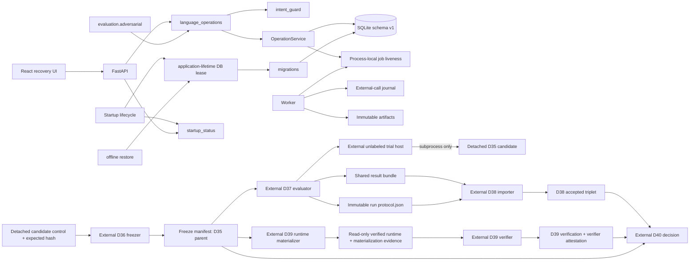
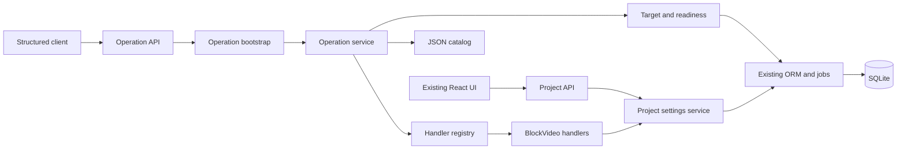
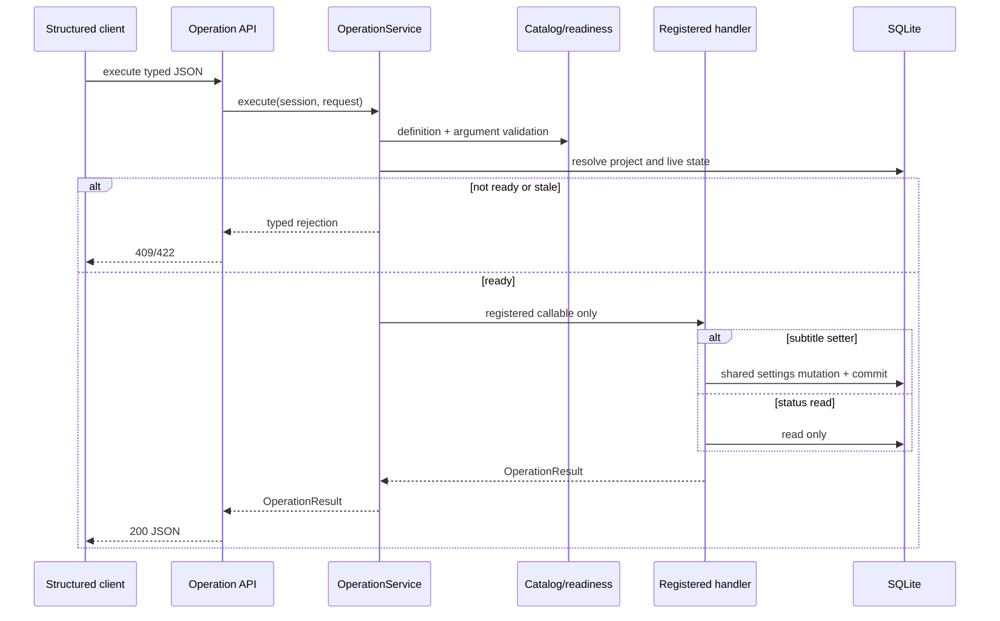

# BlockVideo Plan C — Detailed Technical Design

## D31–D40 Implementation Contract

### Document control

- **Status:** Implementation-ready
- **Delivery mode:** High-Risk for D31 security, D32 concurrency, and D34 migration;
  Standard for the remaining units
- **Specification:** `specification.md`, `docs/plan-c/work-unit-31.md` through
  `docs/plan-c/work-unit-40.md`
- **DTD:** `docs/DTD.md`
- **Updated:** 2026-09-24
- **Scope:** sequential hardening, blinded evaluation, and release-readiness decision
- **Open decisions:** none for implementation. Held-out case content and independent
  evaluator identity remain intentionally outside the implementation process.

### Technical scope and fixed decisions

D31–D35 modify production behavior. The clean D35 delivery commit is the immutable
release candidate. D36 is a later, external tooling commit: it pins that D35 parent
through a strict canonical candidate-control file and detached expected SHA-256,
then freezes an isolated detached checkout of the parent. D37–D40 tooling is also
post-candidate and externally attested; none of it is candidate behavior. D37 runs
only through a separate evaluator against approved, separately mounted held-out
material. D38 imports a non-sensitive aggregate. D39 verifies the exact D35
candidate from isolated temporary environments. D40 emits a decision and never
tags, publishes, or deploys.

The following choices resolve implementation ambiguities:

1. D31 uses a conservative host-side negative-control guard in addition to the
   model prompt. A veto is a safe non-effect and never rewrites one operation into
   another.
2. D32 and D33 first extend tests around existing transaction, receipt, journal,
   checkpoint, and publication seams. Production hooks are added only if a failing
   invariant cannot be exercised by dependency replacement or process termination.
   Public request data can never select a failpoint.
3. D34 uses SQLite `PRAGMA user_version`; unversioned supported databases are
   version 0 and the first explicit current schema is version 1. Compatibility is
   exact at SQLite-affinity level for every existing known column against a scratch
   current-schema database built from registered metadata. Python's `sqlite3` backup
   API creates the pre-migration copy. One non-blocking exclusive database lease is
   acquired before migration and held for the full application lifespan. Offline
   restore acquires the same lease and fails immediately while an app is live. No
   Alembic dependency is added.
4. Migration failure enters a degraded API state: `/api/health` and `/api/startup`
   remain readable, database-dependent endpoints return a fixed 503, and the job
   dispatcher does not start.
5. D37's `stateful` mode is the D30 production semantic configuration with
   readiness annotations and bounded all-tools fallback. D29 B1/B2/P1/B0+ are not
   final-evaluation modes.
6. Detailed held-out evidence remains in evaluator-controlled storage. “Sealed”
   means content-addressed and not imported into this repository; it does not imply
   encryption. Public protocol/result evidence identifies cases and categories only
   with domain-separated evaluator-keyed HMAC-SHA-256 tokens; raw case IDs, text, and
   labels never cross the evaluator boundary. D38 requires an out-of-band expected
   SHA-256 for transfer-integrity validation. Reviewer identity is recorded but not
   cryptographically proven.
7. A source-request group owns one output directory; each case receives a fresh
   database/media child initialized from that case's declared state. Cases do not
   leak mutable state to sibling paraphrases.
8. Human-operation, independent-review, and accepted non-safety limitation evidence
   use strict content-bound JSON records. D40 treats absent records as blockers, not
   as negative results or inferred passes. Completed review evidence requires an
   exact lowercase 64-hex artifact SHA-256; pending/not-performed evidence cannot
   carry an artifact and always blocks.
9. Candidate behavior fixes create a new D35 successor and restart D36. A
   post-candidate tooling-only fix changes that tool's separate source hash and
   reruns every evidence artifact produced by that tool without changing the
   candidate identity.
10. Final evaluation coverage is never vacuous. The D37 protocol has at least one
    case token and one category token; the included set is non-empty; and every
    protocol category has at least one included token in each mode. D37 fails before
    publishing a result when this is false, D38 rejects it, and D40 independently
    emits Not ready.
11. When approval ledgers exclude a case, the reason is deterministic:
    `both_not_approved` when both approvals are absent, otherwise
    `human_not_approved` or `independent_not_approved` for the sole absent approval.
12. D40 generates and validates a canonical decision-source attestation before
    loading decision evidence. Its aggregate is computed from the exact allowlisted
    decision, shared-contract, verification-contract, attestation-contract, and CLI
    source files; `ReadinessDecision.decision_tool_sha256` is derived only from that
    validated aggregate and is never accepted as a caller-provided value.

Runtime remains Windows 11 compatible, Python `>=3.12`, Node `>=20`, local SQLite,
and the existing single-server worker. No cloud call, new runtime dependency, or
private held-out file is required by implementation tests.

### Architecture and dependency direction



Allowed directions:

```text
contracts/models <- services <- API/main
interpretation <- language_operations <- API
operations core <- language_operations
DB/model metadata <- migrations <- main
D35 app public interfaces <- external evaluation trial-host subprocesses
D36 contracts/fingerprints <- D36 freeze script
D24 contracts + D36 unlabeled wire contracts <- D37 evaluator
D37 shared result contracts <- D38 importer <- D40 decision
D36 freeze + D39 verifier contracts <- D40 decision
```

Prohibited directions:

- `app` packages must not import `evaluation`; no D36–D40 tool is copied into or
  imported by the detached D35 candidate.
- `migrations` must not import API routes, operations, workers, evaluation, or UI.
- model interpretation must not import handlers, DB models, or workers.
- the browser must not decide retryability, migration safety, or remote-call status.
- final-evaluation code must not import D29 experiment selectors.

### Technology and research record

No new third-party package is selected. Direct in-scope dependencies are:

| Dependency | Version/constraint | Symbols and role |
|---|---|---|
| Python standard library | Python 3.12.12 verified | `unicodedata.normalize`, `re`, `hashlib.sha256`, `json`, `sqlite3.connect`, `sqlite3.Connection.backup`, `os.open`, `os.close`, `os.unlink`, `os.replace`, `shutil.disk_usage`, `subprocess.run`, `pathlib.Path` |
| SQLAlchemy | locked by `uv.lock`; project `>=2.0.36` | existing `Session`, `select`, `inspect`, `text`; ORM and writer transactions |
| Pydantic | locked by `uv.lock`; project `>=2.9.0` | `BaseModel`, `ConfigDict`, `Field`, validators; strict manifests and API DTOs |
| FastAPI | locked by `uv.lock`; project `>=0.115.0` | `APIRouter`, `Depends`, `HTTPException`; startup status transport |
| pytest | dev dependency `>=8.3.3` | monkeypatch, temporary directories, process/race matrices |
| React | 18.3.1 | recovery/status components |
| TypeScript | project `^5.6.3` | exact frontend mirrors of backend enums |
| Vitest/Testing Library | Vitest 2.1.9 verified | component and interaction tests |

Official sources previously recorded as checked 2026-09-23:

- Python `sqlite3.Connection.backup`: <https://docs.python.org/3/library/sqlite3.html#sqlite3.Connection.backup>
- SQLite `PRAGMA user_version` and `PRAGMA integrity_check`:
  <https://www.sqlite.org/pragma.html#pragma_user_version> and
  <https://www.sqlite.org/pragma.html#pragma_integrity_check>
- SQLite Online Backup API: <https://www.sqlite.org/backup.html>
- SQLAlchemy SQLite dialect/transaction behavior:
  <https://docs.sqlalchemy.org/en/20/dialects/sqlite.html>

Additional authoritative contract reference added for this amendment; live network
verification was not rerun in this documentation-only session:

- SQLite declared-type affinity rules:
  <https://www.sqlite.org/datatype3.html#determination_of_column_affinity>

The backup connection is synchronous and owned/closed by the migration runner.
The application lifespan owns the database lease from pre-migration startup until
all database users stop at shutdown. Migration and application startup are
single-threaded. Offline restore owns a separate lease for only its stopped-app
operation. Existing async model/provider clients retain their present ownership and
deadlines.

### Intended repository structure

```text
backend/app/
├── core/
│   ├── provider_errors.py             # provider-neutral sanitized error contract
│   └── startup_status.py              # process-local bounded startup state
├── migrations/
│   ├── __init__.py
│   ├── backup.py                      # consistent verified SQLite backup
│   ├── contracts.py                   # MigrationResult/Error
│   ├── lease.py                       # non-blocking application-lifetime DB lease
│   ├── runner.py                      # classify, migrate, verify under caller lease
│   └── schema.py                      # v0 -> v1 additive schema operation
├── language_operations/
│   └── intent_guard.py                # deterministic negative-control veto
├── services/
│   └── job_liveness.py                # worker-free process-local liveness view
└── api/
    └── routes_startup.py              # GET /api/startup
backend/evaluation/
├── adversarial.py
├── final_protocol.json                # D36 candidate policy template only
├── unlabeled_contracts.py             # strict label-free host wire model
├── tool_attestation.py                # D36-owned, reused external-tool manifests
├── release_candidate/
│   ├── __init__.py
│   ├── contracts.py                   # candidate control/freeze contracts
│   ├── fingerprints.py                # canonical hashes
│   └── freeze.py                      # clean detached-candidate freeze
├── scripts/
│   ├── evaluation_trial_host.py       # external one-case candidate host
│   ├── freeze_candidate.py            # D36 external CLI
│   ├── materialize_candidate_runtime.py # D39 materialize/cleanup CLI
│   ├── d39_smoke.py                   # external candidate smoke orchestration
│   ├── verify_release_candidate.py    # D39 final external verifier CLI
│   └── attest_release_decision.py     # D40 source-attestation generate/validate CLI
├── blinded_contracts.py
├── blinded_runner.py
├── blinded_scoring.py
├── sealed_evidence.py
├── result_contracts.py                # one D37-owned D37–D40 bundle schema
├── result_import.py
├── runtime_materialization.py         # read-only runtime copy/evidence/cleanup
├── release_verification.py
└── release_decision.py
backend/scripts/
├── run_adversarial.py
├── run_blinded_evaluation.py
├── import_evaluation_result.py
└── decide_release_readiness.py
frontend/src/components/
├── RecoveryStatus.tsx
└── StartupStatus.tsx
backend/tests/
├── test_d31_adversarial_safety.py
├── test_d32_concurrency_matrix.py
├── test_d33_recovery_matrix.py
├── test_d34_migrations.py
├── test_d35_startup_recovery_api.py
├── test_d36_freeze.py
├── test_d37_blinded_runner.py
├── test_d38_result_import.py
├── test_d39_release_verification.py
└── test_d40_readiness_decision.py
```

`release-evidence/` is ignored and stores generated candidate/evaluation evidence.
Migration and blinded synthetic fixtures live under `backend/tests/fixtures/`.

### D31 module, function, and contract design

`app/language_operations/intent_guard.py` owns only deterministic safe vetoes.
It imports `re`, `unicodedata.normalize`, and interpretation proposal contracts.

```python
MUTATING_OPERATIONS: frozenset[str]

def normalized_intent(text: str) -> str: ...

def negative_control_reason(text: str, operation_id: str) -> str | None: ...
```

`normalized_intent` applies NFKC, `casefold()`, translates U+2018/U+2019/U+FF07
apostrophes to ASCII `'`, converts all Unicode whitespace to one ASCII space, and
trims. It does not otherwise remove punctuation or identifiers.
`negative_control_reason` returns `"explicit_negative_intent"` only for a mutating
proposal and these normalized phrase families:

- global: `何もしない`, `実行しない`, `変更しない`, `do nothing`,
  `do not execute`, `don't execute`;
- retry: `再試行しない`, `再実行しない`, `やり直さない`, `do not retry`,
  `don't retry`;
- cancellation: `キャンセルしない`, `取り消さない`, `停止しない`,
  `do not cancel`, `don't cancel`;
- generation: `生成しない`, `開始しない`, `作り直さない`, `do not generate`,
  `don't generate`.

Operation-specific phrases veto only the matching operation family. A global phrase
vetoes every mutating operation. No positive operation is inferred from text.
`LanguageOperationService.prepare()` runs the guard after schema-valid proposal
parsing and before `OperationRequest` construction. A veto preserves the original
interpretation for audit, returns `status="dismissed"`, creates no prepared request
or confirmation token, and records diagnostic `guard_code="negative_intent"`.
`LanguageDiagnostics.guard_code` adds that literal.

`evaluation/adversarial.py` defines strict `AdversarialCase` and `AdversarialResult`
records and loads only `evaluation/d31/development.jsonl`. The loader opens the
corpus once in binary mode, reads at most `MAX_CORPUS_BYTES + 1`, rejects excess
bytes, and only then decodes UTF-8 with optional BOM; it must not use a separate
metadata size check. The harness is single-target: `target_project_id` may be
`None`, otherwise it must exactly equal `initial.project_id`. Cases contain synthetic
text, mode, expected status class, explicit forbidden effects, and exact required
effects for settings, revision, jobs, cancellation, receipts, artifacts, and the
external-call journal. Every D31 case fixes the required external-call-journal
change count at zero and marks any journal change forbidden. Initial jobs (maximum
32), settings
history rows (maximum 32), and prior turns (maximum 8) use dedicated frozen
Pydantic records with `extra="forbid"`; their strings and child collections are
bounded to the existing interpretation/fixture limits. The runner converts the
validated initial state to the existing comparison fixture contract, uses isolated
temporary DB/media roots, and executes the ordinary language/core path.

Effect comparison is content-based. Jobs remain keyed by ID; receipts, artifacts,
and external-call journal records are canonicalized and compared as multisets so an
in-place mutation or same-count replacement is an observed effect. Journal response
bytes are represented only by SHA-256 in the in-memory observation. A result passes
only when its status is allowed, no forbidden effect occurred, and every observed
effect count exactly equals the case's `required_effects`. Result JSON contains
only IDs, status, booleans, and counts; it never contains corpus/model text.

The executable D31 dependency-boundary test imports `evaluation.adversarial`,
`scripts.run_adversarial`, and the registered operation service in a clean Python
process whose import finder rejects `app.workers`, `app.services.pipeline`, and
`app.providers`. Operation readiness therefore reads process-local liveness through
`app.services.job_liveness`; workers publish and clear markers without reversing the
dependency. The sanitized `ProviderError` contract lives in
`app.core.provider_errors`, so schema/settings validation does not import provider
modules. This boundary prevents the tested runner/handler import graph from loading
or starting worker/media-provider execution. It does not prove that arbitrary future
dynamic or unjournaled network code is absent.

`app/main.py` changes the catch-all handler to log only
`error_class`, route, and a generated correlation ID; the JSON response is fixed:

```json
{"detail":{"reason_code":"internal_error","message":"処理に失敗しました。再読み込み後も続く場合は記録番号を確認してください。","correlation_id":"..."}}
```

Raw exception strings, request bodies, model bodies, prompts, raw request paths,
filesystem/private paths, and credentials must not appear in application logs or this
response. Logs may retain the matched framework route template as bounded metadata.
Existing narrow domain errors retain fixed user messages but must not forward
arbitrary provider exception text.

### D32 concurrency design

No new lock service is introduced. `services.transactions.begin_write()` remains
the cross-process serialization boundary using `BEGIN IMMEDIATE`. Tests create
independent SQLAlchemy sessions and, for process cases, spawned Python processes
pointing at one temporary SQLite file.

The matrix covers receipt identity, concurrent settings, dialogue supersession,
generation confirmation/revision change, cancel/publication, retry/recovery,
delete/active-or-unknown work, and startup pending-job claims. Assertions inspect
receipts, settings history, language records, jobs, external calls, artifacts,
current-artifact pointers, and project revision after reopening the database. One
transaction may win. All other effects resolve as exact replay, `stale_state`,
`project_busy`, `dialogue_superseded`, request-content conflict, or bounded
`database_busy`. A `WriteBusyError` response keeps `Retry-After: 1` and tells clients
to retry the same request ID. Process-local locks may reduce duplicate work but
never establish correctness.

A continuation claim calls `dialogue.require_not_superseded()` inside its writer
transaction before project revision resolution. This makes the already committed
parent successor the stable loser reason across answer, correction, and dismissal
races. `dialogue.attach()` reuses the same check before writing the successor link.

Project deletion alone composes the existing active-work guard with persisted
`unknown` jobs and remote-side-effect calls in `in_flight`/`unknown`. Once those are
explicitly resolved, `delete_project_external_calls()` removes target-job journal
rows in the same writer transaction as settings-history, artifact, project, and
cascaded job deletion. Immutable operation receipts survive for exact replay. The
route commits before dropping process-local secrets and before best-effort project-
directory removal; commit failure therefore preserves database state, secrets, and
files.

`dispatch_pending_operation_jobs(*, registry: JobRegistry | None = None) -> int`
uses the process singleton only when `registry is None`. Injection is internal and
adds no HTTP or environment selector. Scans may both submit a stale pending ID; the
worker's database pending-to-running claim remains authoritative and permits one
callback execution. D32 makes no multi-server or capacity claim.

### D33 recovery design

Tests inject failures with monkeypatches at existing callable seams:
`repository.claim`, `receipts.save_receipt`, `httpx.AsyncClient.post`,
`external_calls._finish`, `generation_snapshots.capture_inputs`,
`artifact_store.publish_artifact`, and job-control transitions. Process-kill tests
terminate an isolated app/worker only after an observed durable marker.

No generic production failpoint registry is added. If a demonstrated crash gap
requires a seam, add one private keyword-only callback defaulting to `None` and
construct it only in tests; environment variables and HTTP payloads cannot enable it.
Unknown remote calls remain terminal for automatic replay. Local calls may be
retried only under existing fingerprint rules. Publication always validates file
identity before changing current-artifact pointers.

### D34 migration and startup design

#### Persistent version and supported ancestry

- `PRAGMA user_version = 0`: empty DB, upstream/pre-Plan-C DB, or current D30 DB
  created before explicit versioning.
- `PRAGMA user_version = 1`: D34 schema after all current ORM tables and additive
  columns are present.
- Values greater than 1 are rejected as `schema_too_new`.

Version 0 classification is structural. The critical known tables are exactly
`projects`, `blocks`, `generation_jobs`, `operation_requests`, `external_calls`,
`generation_artifacts`, `settings_revisions`, `language_requests`, and
`language_turns`. Unknown extra tables and unknown extra columns are preserved.
Before accepting any non-empty supported v0 or v1 database, registered
`Base.metadata` creates a scratch current-schema SQLite database. `PRAGMA table_info` is read from both files.
For every existing column whose table and column name are known to current metadata,
the observed SQLite affinity must equal the scratch column's affinity. Affinity is
derived from the declared type using SQLite's ordered rules: `INT` -> `INTEGER`;
`CHAR`/`CLOB`/`TEXT` -> `TEXT`; `BLOB` or an empty declaration -> `BLOB`;
`REAL`/`FLOA`/`DOUB` -> `REAL`; otherwise `NUMERIC`. A known-column name collision
with any unequal affinity fails `unsupported_legacy_schema`; aliases, coercible
runtime values, and SQLAlchemy type-family similarity do not relax the comparison.
Missing tables are created from current metadata. Missing columns are added only
when nullable or when a server default can preserve existing rows. No column is
dropped, renamed, or retyped.

Before backup or DDL, the runner captures for every critical table that exists:
(1) exact row count and (2) a canonical primary-key identity digest. The digest is
SHA-256 over compact, sorted-key, UTF-8 JSON containing the table name, ordered PK
column names from the scratch schema, and every PK tuple encoded as typed values
(`integer` with canonical decimal text or `text` with the exact string), sorted by
the canonical encoded tuple bytes. There are no locale-dependent conversions. After
migration, every pre-existing critical table must have the same count and digest;
newly created critical tables must be empty. Backup verification computes and
compares the same values against the source snapshot. These are identity-preservation
checks, not full-row content hashes.

The runner also executes `PRAGMA foreign_key_check` and explicit ID-reference checks
before backup and after migration. Required ownership references are:
`blocks.project_id -> projects.id`, `generation_jobs.project_id -> projects.id`,
non-null `generation_jobs.parent_job_id -> generation_jobs.id` with equal project
ownership, `external_calls.job_id -> generation_jobs.id`,
`generation_artifacts.project_id -> projects.id`, non-null
`generation_artifacts.job_id -> generation_jobs.id` with equal project ownership,
`settings_revisions.project_id -> projects.id`, non-null
`settings_revisions.restored_from_revision` to the same project's revision,
non-null `projects.current_artifact_id -> generation_artifacts.id` with equal project
ownership, `language_turns.request_id -> language_requests.request_id`, and non-null
`language_turns.parent_request_id`/`successor_request_id` to existing request and
turn IDs with reciprocal predecessor/successor consistency. The
`operation_requests.project_id` and nullable `operation_requests.job_id` columns are
intentional non-FKs: immutable receipts survive project/job deletion and reserve
those IDs against reuse, so existence is not required; when a referenced job still exists, its project ID
must equal the receipt project ID. `language_requests.project_id` and
`core_request_id` are likewise durable correlation references: when the target or
receipt exists its ID and ownership must agree, but absence is valid for deleted
projects or requests that never committed an operation. No relationship is validated
by row order, display text, title, or other mutable content.

#### Migration interfaces

```python
@dataclass(frozen=True)
class MigrationResult:
    status: Literal["created", "current", "migrated"]
    from_version: int
    to_version: int
    backup_created: bool
    backup_sha256: str | None

class MigrationError(RuntimeError):
    reason_code: Literal[
        "database_lease_unavailable", "schema_too_new", "unsupported_database",
        "unsupported_legacy_schema", "backup_failed", "backup_invalid",
        "migration_failed", "migration_verification_failed"
    ]

class DatabaseLease:
    database_path: Path
    lock_path: Path
    def assert_held_for(self, database_url: str) -> None: ...
    def release(self) -> None: ...

def acquire_database_lease(database_url: str) -> DatabaseLease: ...

def migrate_database(
    database_url: str, metadata: MetaData, *, lease: DatabaseLease
) -> MigrationResult: ...

def restore_database_backup(
    database_url: str, backup_path: Path, expected_sha256: str
) -> None: ...
```

Only file-backed `sqlite:///` URLs are migrated. In-memory test databases are
created directly and assigned version 1. Any other dialect fails
`unsupported_database`; D34 does not claim cross-database support.

`acquire_database_lease()` resolves the configured file-backed database and attempts
one sibling `<database>.migration.lock` creation with `os.open(...,
O_CREAT|O_EXCL|O_WRONLY)`. Acquisition never polls, sleeps, retries, or removes an
existing file; contention raises `database_lease_unavailable` before the database is
opened. The file contains PID and UTC time but those values are never returned
through HTTP. The returned `DatabaseLease` retains ownership until `release()`;
release is idempotent, closes the descriptor, removes only its owned lease file, and
occurs after all database users stop. A stale lease is not removed automatically;
explicit operator removal is allowed only after confirming no application or restore
process is running.

For a non-empty version-0 DB, free space must exceed database size plus 16 MiB.
`sqlite3.Connection.backup()` writes to a temporary sibling in
`<db-parent>/.backups/`; `PRAGMA integrity_check` must return exactly `ok`; critical
source table row counts must match. The file is flushed, atomically renamed, and
SHA-256 recorded. The migration then uses one SQLite transaction for additive DDL
and `PRAGMA user_version=1`. Post-verification checks integrity, required tables and
columns, preserved pre-migration row counts, and foreign-key violations. Failure
rolls back where SQLite permits and retains the verified backup. Every migration
entry point requires a live caller-owned `DatabaseLease` bound to the same canonical
database path and rejects a missing, released, or mismatched lease before database
I/O; migration never releases the application lease.

Operational rollback is offline only. `restore_database_backup()` first acquires the
same database lease non-blocking, then copies the selected verified backup to a new
temporary file, verifies its expected hash/integrity, atomically replaces the target,
and releases the lease in `finally`. If an application (including degraded startup)
is live, restore fails `database_lease_unavailable` before reading the backup or
opening/replacing the target. Reverse SQL is prohibited.

`db.init_db()` becomes registration plus `Base.metadata.create_all()` only for a
migration-approved/current database; reflective mutation moves to
`migrations/schema.py`. `main.lifespan()` registers models, acquires the lease, calls
migration before `init_db()` and interrupted-job recovery, retains the lease while
ready or degraded, stops dispatcher/database users at shutdown, and releases the
lease as its final database-lifecycle action.

#### Degraded startup contract

`core/startup_status.py` owns one process-local immutable snapshot:

```python
class StartupStatus(BaseModel):
    status: Literal["starting", "ready", "migration_failed"]
    reason_code: str | None
    message: str
    schema_version: int | None
    backup_available: bool
```

`GET /api/startup` returns 200 with that value. `/api/health` returns
`status="degraded"` when migration failed. `get_db()` raises a fixed
`StartupUnavailableError` before creating a session unless status is ready; the
exception maps to HTTP 503 with `Retry-After: 5`. The dispatcher and recovery
reconciliation do not run in degraded state.

### D35 recovery UI and API design

`JobSummary` adds required fields:

```python
recovery_code: Literal[
    "wait", "safe_retry", "external_outcome_unknown", "refresh_required",
    "cancelled", "completed", "failed"
]
recommended_action: Literal[
    "wait", "retry_current", "check_provider", "refresh", "none"
]
```

`job_views.job_summary()` derives both from persisted status, cancellation flag,
and unresolved-call query. Existing prose fields remain compatibility display text,
but button state uses only `retryable` and `recommended_action`.

Frontend mirrors these exact unions. `RecoveryStatus.tsx` renders one status region
and optional action description; it does not execute an action itself.
`StartupStatus.tsx` fetches `/api/startup`, displays the bounded reason, and directs
the user to the documented backup/restart procedure. `GenerationHistory` uses the
new fields for labels and control visibility. All buttons remain native buttons,
status text uses `role="status"` or `role="alert"`, and focus order follows DOM order.

### D36 frozen D35 candidate and external trial boundary

The candidate is exactly the clean `[DONE] Mission 35 Add recovery-oriented
operational UI` commit. D36 tooling is committed later and freezes an isolated,
detached checkout of that D35 parent. Before any D36 output, the operator supplies a
canonical `CandidateControl` plus its expected SHA-256 through a separate channel:

```python
class CandidateControl(BaseModel):
    model_config = ConfigDict(extra="forbid", frozen=True)
    schema_version: Literal[1]
    git_commit: Annotated[str, Field(pattern=r"^[0-9a-f]{40}$")]
    git_commit_subject: Literal["[DONE] Mission 35 Add recovery-oriented operational UI"]
    git_tree_clean: Literal[True]

class FileFingerprint(BaseModel):
    path: str
    sha256: str
    size: int

class FreezeManifest(BaseModel):
    schema_version: Literal[1]
    candidate_id: str
    git_commit: str
    git_tree_clean: Literal[True]
    candidate_control_sha256: str
    created_at: str
    runtime: dict[str, str]
    schema_version_number: int
    mode_configuration: dict[str, object]
    files: list[FileFingerprint]
    aggregate_sha256: str
```

`evaluation/release_candidate/freeze.py` reads bounded control bytes once, validates
the detached lowercase 64-hex digest before parsing, requires byte-for-byte canonical
JSON and the exact fields above, and then matches commit, subject, and cleanliness to
the detached candidate. `FreezeManifest.created_at` is not wall-clock time: it is the
candidate commit's integer committer timestamp (`git show -s --format=%ct`) rendered
in UTC exactly as `YYYY-MM-DDTHH:MM:SSZ`. Git timestamps are second precision, so no
fraction is emitted. The freezer rechecks commit and cleanliness immediately before
atomic publication. Given identical candidate-control bytes, candidate bytes,
allowlisted inputs, and runtime/version strings, canonical manifest bytes are
byte-identical; generation time, host locale, timezone, temp paths, and directory
enumeration order cannot affect them. The fingerprint allowlist contains D35 behavior and its manifests,
lockfiles, frontend source, profiles, tests, and design contracts as they existed in
D35; it explicitly excludes all later D36–D40 tooling plus `.env`, databases, media,
weights, caches, `node_modules`, and held-out material. Paths are lexical relative
POSIX paths. `candidate_id` is
`aggregate_sha256[:16] + "-" + git_commit[:12]`. D36 also creates the shared strict `evaluation/tool_attestation.py` contract. A
separate canonical D36 source attestation identifies the post-candidate
freezer/protocol/unlabeled-contract/host allowlist and never replaces
`FreezeManifest.git_commit` or `aggregate_sha256`; D37–D40 reuse the attestation
model and canonical hashing unchanged.

`evaluation/final_protocol.json` is the canonical D36 policy template only. The
external `evaluation_trial_host` accepts exactly one strict independent wire object:

```python
class UnlabeledTrialCase(BaseModel):
    model_config = ConfigDict(extra="forbid", frozen=True)
    schema_version: Literal[1]
    case_id: str
    group_id: str
    category: str
    split: Literal["held_out"]
    event: UnlabeledEvent
    initial: UnlabeledInitialState
    case_sha256: str
```

Neither this model nor any nested model may inherit from, import, embed, deserialize
through, or expose D24's label-bearing `Case`; no field graph may contain `expected`,
accepted operations/answers, scoring labels, review state, or generic extras. D37
projects each approved `Case` through an explicit allowlist before serialization.
The host rejects label/review/scoring fields, multiple cases, wrong mode/index
combinations, or non-empty output before candidate invocation. It executes D35
public/application interfaces only through a candidate-rooted subprocess; all case
storage and observations remain external. Its redacted observation contains effects,
call/failure classes, replay/confirmation observations, and hashes, never request
text, model bodies, labels, expected values, or private paths.

### D37 canonical protocol artifact and shared full result bundle

`EvaluationProtocol` is strict version 1. It binds `candidate_id`, exact modes
`("all_tools", "stateful")`, 180 seconds per call, at most four model calls,
`fresh_case_state_under_source_group`, corpus hash, separate human and independent
approval hashes, D36 freeze hash, D36 candidate trial-tool hash, D37 evaluator/runner
tool hash, model-configuration hash, stateful-index hash, and only opaque case/category
identities. The evaluator owns a secret corpus-token key that never appears in a CLI,
manifest, protocol, bundle, log, source tree, or repository fixture. The key file contains exactly 32 raw bytes and is read once with a 33-byte bounded
read; shorter or longer files fail. For each validated ASCII D24 case ID the evaluator
computes lowercase 64-hex
`HMAC-SHA256(key, b"blockvideo-case-v1\0" + utf8(case_id))`. Each case's private
category ID is exactly its first validated non-empty D24 `tags` entry; category tokens
use the separate domain
`b"blockvideo-category-v1\0" + utf8(category_id)`. The canonical
protocol contains `case_count`, the complete lexicographically sorted unique
`case_tokens`, and `case_categories` sorted by `(case_token, category_token)`, with
exactly one binding per case token. `case_count`, `case_tokens`, `category_count`,
and `category_tokens` are all non-zero/non-empty; every declared category token is
bound to at least one case. It contains the sorted unique category-token set/count,
but contains no raw case ID, request text, expected value, category name, review
label, or approval decision. A zero-case or zero-category corpus fails D37 protocol
creation before any trial and can never produce a passing bundle.

```python
OpaqueToken = Annotated[str, Field(pattern=r"^[0-9a-f]{64}$")]

class CaseCategoryBinding(BaseModel):
    case_token: OpaqueToken
    category_token: OpaqueToken

def opaque_case_token(key: bytes, case_id: str) -> OpaqueToken: ...
def opaque_category_token(key: bytes, category_id: str) -> OpaqueToken: ...

class EvaluationProtocol(BaseModel):
    schema_version: Literal[1]
    candidate_id: str
    modes: tuple[Literal["all_tools"], Literal["stateful"]]
    per_call_deadline_seconds: Literal[180]
    maximum_model_calls: Literal[4]
    isolation: Literal["fresh_case_state_under_source_group"]
    corpus_sha256: str
    human_approval_sha256: str
    independent_approval_sha256: str
    freeze_sha256: str
    d36_trial_tool_sha256: str
    d37_evaluator_tool_sha256: str
    model_configuration_sha256: str
    stateful_index_sha256: str
    category_count: Annotated[int, Field(gt=0)]
    category_tokens: Annotated[tuple[OpaqueToken, ...], Field(min_length=1)]
    case_count: Annotated[int, Field(gt=0)]
    case_tokens: Annotated[tuple[OpaqueToken, ...], Field(min_length=1)]
    case_categories: tuple[CaseCategoryBinding, ...]
```

Each run exclusively creates one immutable canonical `<run-output>/protocol.json`
before its first trial. The SHA-256 of those exact bytes is `protocol_sha256`.
Resume requires the same existing bytes. Mutation, replacement, regeneration, or use
of D36 `final_protocol.json` as the result protocol fails closed. D38 validates this
run artifact; D40 consumes its identity only through D38-accepted evidence.

`evaluation/result_contracts.py` is owned by D37 and is the only D37–D40 aggregate
schema. Every model is frozen/strict with `extra="forbid"`; D38 and D40 import these
models unchanged and may not redeclare, subclass, normalize, infer omissions, or
create a reduced schema:

```python
class CategoryResult(BaseModel):
    category_token: OpaqueToken
    included: Annotated[int, Field(gt=0)]
    completed: int
    task_complete: int
    unauthorized_effects: int
    unauthorized_replays: int
    secret_disclosures: int

class ModeResult(BaseModel):
    mode: Literal["all_tools", "stateful"]
    included: Annotated[int, Field(gt=0)]
    completed: int
    task_complete: int
    unauthorized_effects: int
    unauthorized_replays: int
    secret_disclosures: int
    transport_failures: int
    deadline_failures: int
    categories: tuple[CategoryResult, ...]

class ExcludedCaseToken(BaseModel):
    case_token: OpaqueToken
    reason: Literal[
        "both_not_approved",
        "human_not_approved",
        "independent_not_approved",
    ]

class EvaluationResultBundle(BaseModel):
    schema_version: Literal[1]
    candidate_id: str
    freeze_sha256: str
    corpus_sha256: str
    human_approval_sha256: str
    independent_approval_sha256: str
    protocol_sha256: str
    d36_trial_tool_sha256: str
    d37_evaluator_tool_sha256: str
    protocol_case_count: Annotated[int, Field(gt=0)]
    included_count: Annotated[int, Field(gt=0)]
    excluded_count: Annotated[int, Field(ge=0)]
    included_case_tokens: Annotated[tuple[OpaqueToken, ...], Field(min_length=1)]
    excluded_cases: tuple[ExcludedCaseToken, ...]
    evaluator_role: Literal["independent_evaluator"]
    evaluator_name: str
    executed_at: str
    sealed_evidence_sha256: str
    modes: tuple[ModeResult, ModeResult]
```

The evaluator name is explicit, non-empty, and bounded; `executed_at` is canonical
UTC evidence time. `included_case_tokens` is unique and lexicographically sorted.
`excluded_cases` is unique and sorted by `case_token`; each item carries exactly one
approval reason. Reason selection is total and deterministic: both approvals absent
maps to `both_not_approved`; only human absent maps to `human_not_approved`; only
independent absent maps to `independent_not_approved`; a doubly approved case is
included and has no exclusion entry. Included and excluded token sets are disjoint,
their exact union equals the protocol's complete token set, their lengths equal the
declared counts, and `protocol_case_count == included_count + excluded_count ==
protocol.case_count`. `included_count >= 1` and `included_case_tokens` is non-empty.
For every opaque category token, included/excluded counts are derived from the
protocol bindings; the derived included count is at least one and each mode's
category `included` value must equal it and therefore be at least one. A category
whose cases are all excluded invalidates the D37 run rather than becoming a vacuous
category pass. D38 derives the reason-by-category exclusion matrix directly from the
protocol bindings and excluded entries; its row/category and reason totals must each
sum exactly to `excluded_count`. Each mode uses the protocol's exact non-empty sorted
category-token set/order and `included_count`; category totals equal mode totals;
`task_complete <= completed <= included`; and
`completed + transport_failures + deadline_failures == included`. No failed,
timed-out, or omitted trial becomes an exclusion. The bundle contains no raw case
IDs, request text, expected values, category names, or labels. Scoring covers declared events,
full persisted effects, receipts/artifacts, replay, confirmation, and disclosure.
Unexpected mutation, replay, and disclosure are separately counted overall and by
category. Detailed records remain sealed in evaluator storage.

D36 candidate trial-tool, D37 evaluator/runner, D38 importer, D39 verifier, and D40
decision sources each have separate canonical `ToolAttestation.aggregate_sha256`
values. They are never combined with each other, the approvals, or the candidate
fingerprint.

### D38 validation and import bindings

The importer first validates the raw result bytes against the separately supplied
`--expected-sha256`, then parses only D37's shared `EvaluationResultBundle`. It reads
the supplied D37 `protocol.json` as bounded raw canonical bytes and requires its hash
to equal `bundle.protocol_sha256`. It cross-binds protocol, bundle, freeze, and tool attestations for candidate, corpus,
separate human/independent approvals, D36 freeze, D36 trial tool, D37 evaluator tool,
model configuration, stateful index, opaque categories, and the complete case-token
set. It rejects duplicate tokens, unsorted arrays, a token in both sets, any missing or
extra token, zero protocol/included/category coverage, a category with no included
token in either mode, count mismatch, category-binding mismatch, exclusion
reason/count mismatch, and any raw ID/text/label field. It recomputes exact
union and per-category accounting from protocol tokens
rather than trusting aggregate counts. D36 `final_protocol.json`, equivalent regenerated policy, a
protocol outside the run output, non-canonical bytes, and symlinks are rejected.

```python
class ImportValidation(BaseModel):
    schema_version: Literal[1]
    status: Literal["accepted"]
    candidate_id: str
    source_bundle_sha256: str
    accepted_bundle_sha256: str
    corpus_sha256: str
    human_approval_sha256: str
    independent_approval_sha256: str
    protocol_sha256: str
    freeze_sha256: str
    d36_trial_tool_sha256: str
    d37_evaluator_tool_sha256: str
    d38_import_tool_sha256: str
    checks: dict[str, Literal[True]]
```

`checks` has exactly these keys, all `true`, with no extras:
`bundle_detached_sha256`, `bundle_canonical`, `protocol_canonical`,
`protocol_sha256`, `candidate_binding`, `corpus_binding`, `approval_bindings`,
`freeze_binding`, `tool_bindings`, `token_syntax`, `token_unique_sorted`,
`token_disjoint`, `token_exact_union`, `token_counts`, `nonempty_coverage`,
`exclusion_reasons`, `category_accounting`, `mode_accounting`, and
`sealed_evidence_hash_syntax`.

The importer revalidates all accounting invariants above, evaluator identity/time,
and exact two-mode/category symmetry without normalization. It atomically writes the
canonical shared-schema `accepted-result.json`, `validation.json`, and a separate
`d38-tool-attestation.json`. `validation.accepted_bundle_sha256` hashes the exact
accepted bytes; `validation.d38_import_tool_sha256` equals the importer attestation's
aggregate hash. It never opens, enumerates, or reconstructs sealed detailed evidence.

### D39 external exact-candidate verification

Materialization is a separate pre-smoke operation, not an internal side effect of the
final verifier:

```python
def materialize_candidate_runtime(
    *, candidate_root: Path, freeze_manifest_path: Path,
    work_root: Path, output_path: Path,
) -> RuntimeMaterialization: ...

def cleanup_candidate_runtime(
    *, runtime_root: Path, work_root: Path, materialization_path: Path,
    expected_materialization_sha256: str,
) -> None: ...
```

`python -m evaluation.scripts.materialize_candidate_runtime` verifies the D36 raw
manifest, detached D35 commit, candidate fingerprints, clean status, and
tracked-plus-ignored snapshot before copying. It creates a new non-symlink runtime
under the exact path `<work_root>/runtime-<runtime_instance_id>`, copies only verified
tracked candidate files, rejects special files
and escaping links, recomputes every file hash/size and the freeze aggregate, records
canonical `runtime-materialization.json`, then clears write bits on every regular
file (`stat.S_IREAD`) and leaves directories read/execute-only
(`stat.S_IREAD | stat.S_IEXEC`); inability to apply or verify those modes fails and
cleans the partial runtime. On Windows it verifies that `Path.stat().st_mode & stat.S_IWRITE == 0` for every
regular file after `os.chmod()`. No command
runs directly in this tree, so build tools cannot require source-root writes. The record binds candidate ID, D35 commit, exact freeze hash, candidate
snapshot hash, sorted runtime file manifest, `runtime_source_sha256`, a random
single-use `runtime_instance_id`, and creation status; it stores only root aliases,
never absolute paths. Its canonical bytes are hashed for downstream evidence. The
runtime contains no environment, cache, dependency install, output, database, media,
browser profile, log, or evidence directory. Because existing build tools may write
beside source, no command executes directly in the read-only runtime.

The D39 workflow uses exactly three execution groups, each under a new random,
non-symlink tooling-owned temporary root outside both candidate and runtime. The
smoke producer owns the smoke group; the final verifier owns the backend and frontend
command groups and validates the already bound smoke manifest:

1. **Backend command group:** copy only independently verified tracked runtime files
   into one fresh writable sandbox, then execute `backend_uv_sync`, `backend_import`,
   `backend_pytest`, `backend_ruff`, and `backend_d31_d35` in that order. The created
   uv environment and dependency state persist for these five commands only.
2. **Frontend command group:** independently reverify the immutable runtime, copy its
   verified tracked files into a different fresh writable sandbox, then execute
   `frontend_pnpm_install`, `frontend_test`, `frontend_build`, and `frontend_lint` in
   that order. `node_modules`, pnpm store/cache, npm cache, and build state persist
   from install through lint only within this group.
3. **Smoke group:** independently reverify the immutable runtime and create a third
   fresh writable sandbox for migration/restore, both startup modes, browser, and
   FFmpeg smoke. It does not reuse either command-group sandbox or installed state.

For every group, the responsible D39 tool hashes the sandbox's tracked source
immediately after copying and before execution, rehashes tracked source after each
command or fixed smoke stage and at group end, and requires equality with
`runtime_source_sha256`.
Generated dependencies, caches, build output, databases, media, and browser state are
not tracked source and remain contained in that group's external root. The responsible tool independently walks and hashes runtime bytes, permissions, and
file types immediately before deriving each group and again after that group's sandbox
is discarded; each result must equal the materialization record and D36 freeze. It
likewise compares the candidate's tracked-plus-ignored snapshot before and after every
group. The final verifier repeats the immutable-runtime and candidate checks before
accepting the separately produced smoke manifest. A group is
fail-fast and its sandbox and all non-evidence state are discarded in `finally` on
success or failure. Bounded evidence is written only to the separate external evidence
root.

`evaluation/release_verification.py` consumes the runtime root plus materialization
record and its separately supplied expected SHA-256. Smoke evidence binds
`candidate_id`, D35 commit, freeze hash, materialization-record hash,
`runtime_instance_id`, and `runtime_source_sha256`; evidence from another runtime is
rejected. Command working directories are the backend or frontend directory of the
appropriate group sandbox, never the read-only runtime or candidate. Each of the nine
commands still emits its own `CommandEvidence`; grouping does not combine, omit, or
replace per-command argv, cwd alias, exit code, timestamps, or bounded stdout/stderr
hashes. The verifier also proves the original candidate and immutable runtime remain
unchanged.

```python
class CommandEvidence(BaseModel):
    name: str
    argv: tuple[str, ...]
    cwd: str
    exit_code: int
    started_at: str
    finished_at: str
    stdout_sha256: str
    stderr_sha256: str

class SmokeManifest(BaseModel):
    schema_version: Literal[1]
    candidate_id: str
    git_commit: str
    freeze_sha256: str
    materialization_sha256: str
    runtime_instance_id: str
    runtime_source_sha256: str
    legacy_migration_sha256: str
    restore_sha256: str
    all_tools_startup_sha256: str
    stateful_startup_sha256: str
    browser_sha256: str
    ffmpeg_sha256: str

class VerificationManifest(BaseModel):
    schema_version: Literal[1]
    candidate_id: str
    git_commit: str
    freeze_sha256: str
    verifier_tool_sha256: str
    status: Literal["passed", "failed"]
    commands: tuple[CommandEvidence, ...]
    smoke_manifest_sha256: str
    smoke_manifest: SmokeManifest
    secret_scan_passed: bool
    candidate_clean_before: Literal[True]
    candidate_clean_after: Literal[True]
    candidate_snapshot_before_sha256: str
    candidate_snapshot_after_sha256: str
    materialization_sha256: str
    runtime_instance_id: str
    runtime_source_sha256: str
    runtime_snapshot_after_sha256: str
    cleanup_status: Literal["completed", "failed"]
```

The fixed `shell=False` command inventory contains exactly these nine `(name, argv)`
entries, in this order, each exactly once:

```text
backend_uv_sync           ("python", "-m", "uv", "sync", "--frozen")
backend_import            ("python", "-m", "uv", "run", "python", "-c", "import app.main")
backend_pytest            ("python", "-m", "uv", "run", "pytest")
backend_ruff              ("python", "-m", "uv", "run", "ruff", "check", ".")
backend_d31_d35           ("python", "-m", "uv", "run", "pytest", "tests/test_d31_adversarial_safety.py", "tests/test_d32_concurrency_matrix.py", "tests/test_d33_recovery_matrix.py", "tests/test_d34_migrations.py", "tests/test_d35_startup_recovery_api.py", "-q")
frontend_pnpm_install     ("npx", "-y", "pnpm@10.18.3", "install", "--frozen-lockfile")
frontend_test             ("npx", "-y", "pnpm@10.18.3", "test")
frontend_build            ("npx", "-y", "pnpm@10.18.3", "build")
frontend_lint             ("npx", "-y", "pnpm@10.18.3", "lint")
```

`evaluation.release_verification.D39_REQUIRED_COMMANDS` is this immutable ordered
nine-tuple. Entries 1–5 execute in the single backend group sandbox and entries 6–9
execute in the single frontend group sandbox; the separate smoke group adds no entry
to this inventory. The verifier uses the tuple to execute, and D40 independently
compares the parsed manifest's full `(name, argv)` sequence to it and checks every
exit code; D40 never trusts `VerificationManifest.status` as a substitute. Every entry must have
`exit_code == 0`; duplicate, missing, additional, reordered, or argv/name-mismatched
entries invalidate the verification. Legacy migration/backup,
restore, both-mode startup, recovery browser journey, and real FFmpeg with fake
providers are mandatory smoke evidence, not caller-extensible commands. The exact
canonical `SmokeManifest` is embedded in `VerificationManifest`; its canonical bytes
hash to `smoke_manifest_sha256`. Every one of its six smoke hashes is exact lowercase
64-hex and binds the same candidate, commit, freeze, materialization, runtime instance,
and runtime source as the verification manifest. Stdout/stderr are bounded to 2 MiB.
A secret/private/generated-file scan records rule IDs/counts only. Candidate/runtime drift or any command/smoke failure stops subsequent work and yields
failed evidence. A partial materialization is removed by the materializer before it
returns failure. After the final independent runtime recheck, the verifier calls
`cleanup_candidate_runtime()` in `finally`; cleanup verifies the detached expected materialization hash before parse, the
single-use marker, and containment beneath `work_root`, removes the read-only runtime and
all external environment/cache/temp/browser/database/media roots, and preserves only
bounded canonical evidence. Cleanup is idempotent. A cleanup failure sets
`status="failed"` and `cleanup_status="failed"` and reports only a root alias. If the
verifier is never started after successful materialization, the operator runs the
same dedicated cleanup CLI with the record; it refuses an unbound or out-of-root
path. D39 atomically emits
`verification-manifest.json` plus a distinct canonical D39 verifier source
attestation whose aggregate hash equals `VerificationManifest.verifier_tool_sha256`.
A candidate failure restarts at D36; a verifier-only change gets a new verifier hash
and a complete D39 rerun in a new evidence directory. A passed manifest additionally
requires `secret_scan_passed is True`, both clean flags true,
`candidate_snapshot_before_sha256 == candidate_snapshot_after_sha256`,
`runtime_snapshot_after_sha256 == runtime_source_sha256`, and
`cleanup_status == "completed"`.

### D40 exact readiness decision

D40 requires D36 freeze; all three D38 artifacts; D39
`verification-manifest.json`; the D39 verifier source attestation; human operation;
and independent review. Raw bytes of the D38 triplet, D39 verification manifest, and
D39 verifier attestation each require a separately supplied detached expected
lowercase 64-hex SHA-256 before parsing. A missing file, missing/malformed detached
digest, digest mismatch, non-canonical file, or schema error becomes its own named
Not-ready blocker.

Before deciding, `python -m evaluation.scripts.attest_release_decision` invokes the
shared `attest_tool_source()` API to generate and validate canonical
`decision-tool-attestation.json`. Its exact source allowlist is:

```text
evaluation/release_decision.py
evaluation/result_contracts.py
evaluation/result_import.py
evaluation/release_verification.py
evaluation/tool_attestation.py
evaluation/scripts/attest_release_decision.py
scripts/decide_release_readiness.py
```

No glob, directory walk, caller-added path, omission, duplicate, or alternate file is
permitted. The attestation uses the shared canonical `ToolAttestation` model, sorted
POSIX paths, per-file size/SHA-256, and canonical aggregate hash. The attestation CLI
requires an out-of-band `--expected-sha256` and rejects a malformed or unequal
expected aggregate before atomically publishing the artifact. The decision CLI then
requires `--decision-tool-attestation` and the same detached
`--decision-tool-expected-sha256`, rehashes the exact allowlist before evaluating any
gate, and rejects any artifact/current-source/expected-aggregate mismatch without
creating `decision.json` or `decision.md`. It passes the validated `ToolAttestation` object to the decision engine; there is no
`decision_tool_sha256` CLI option or free-form API parameter. The decision records the
attestation file's actual canonical-byte hash under
`input_sha256["decision_tool_attestation"]` and its validated source aggregate under
`decision_tool_sha256`; these two hashes have distinct meanings.

D40 imports D37's `EvaluationResultBundle`, D38's `ImportValidation`, and D39's
`VerificationManifest`; it does not fork them. It cross-binds:

- actual D38 accepted bytes to `validation.accepted_bundle_sha256` and all candidate,
  freeze, corpus, separate approval, run-protocol, D36 trial-tool, and D37 evaluator
  identities;
- actual D38 tool attestation to `validation.d38_import_tool_sha256`;
- actual D39 verification-manifest hash to its detached expected hash and decision
  input map;
- D39 candidate ID, D35 Git commit, and freeze hash to D36;
- `VerificationManifest.verifier_tool_sha256` to the separately detached and parsed
  D39 verifier source attestation aggregate hash;
- the D39 command inventory to the exact nine ordered name/argv pairs exactly once,
  with every exit code zero;
- the embedded D39 smoke manifest's canonical hash and all six mandatory smoke hashes,
  plus candidate/commit/freeze/materialization/runtime bindings;
- D39 secret scan, candidate cleanliness, candidate snapshot equality, runtime
  snapshot equality, and completed cleanup; and
- every review and limitation candidate ID to D36.

```python
class ReviewEvidence(BaseModel):
    kind: Literal["human_operation", "independent_review"]
    candidate_id: str
    status: Literal["completed", "failed", "pending", "not_performed"]
    reviewer: str
    recorded_at: str
    artifact_sha256: str | None

class AcceptedNonSafetyLimitation(BaseModel):
    schema_version: Literal[1]
    candidate_id: str
    limitation_id: str
    classification: Literal["non_safety"]
    status: Literal["accepted"]
    description_sha256: str
    approver: str
    approved_at: str
    approval_artifact_sha256: str

class GateResult(BaseModel):
    name: str
    passed: bool
    evidence_sha256: str | None
    detail: str

class ReadinessDecision(BaseModel):
    schema_version: Literal[1]
    candidate_id: str
    outcome: Literal["Ready", "Conditionally ready", "Not ready"]
    selected_default: Literal["all_tools", "stateful"]
    gates: tuple[GateResult, ...]
    blockers: tuple[str, ...]
    accepted_limitations: tuple[AcceptedNonSafetyLimitation, ...]
    input_sha256: dict[str, str]
    decision_tool_sha256: str

# In evaluation.release_decision; the fixed allowlist is module-owned.
def attest_and_validate_decision_tool(
    *, repo_root: Path, output_path: Path, expected_sha256: str,
) -> ToolAttestation: ...

def load_decision_tool_attestation(
    *, repo_root: Path, attestation_path: Path, expected_sha256: str,
) -> tuple[ToolAttestation, str]: ...

def decide_readiness(
    *, freeze: FreezeManifest, aggregate: EvaluationResultBundle | None,
    import_validation: ImportValidation | None,
    d38_tool_attestation: ToolAttestation | None,
    d38_input_sha256: dict[str, str],
    verification: VerificationManifest | None,
    verifier_tool_attestation: ToolAttestation | None,
    d39_input_sha256: dict[str, str],
    human: ReviewEvidence | None, independent: ReviewEvidence | None,
    limitation_approvals: tuple[AcceptedNonSafetyLimitation, ...],
    decision_tool_attestation: ToolAttestation,
) -> ReadinessDecision: ...
```

No hash is trimmed or case-normalized. Every content/artifact hash is exact lowercase
64-hex. Completed review evidence requires an artifact; pending/not-performed must
carry `None`; failed always blocks. Limitation evidence is optional, canonical,
candidate-bound, uniquely identified, content-hashed, and separately approval-hashed;
free text, safety limitations, pending/unaccepted records, malformed hashes, or
candidate mismatch cannot support conditional readiness.

The two-mode semantics are exact and independent. Before ratio evaluation, D40
independently requires a non-empty protocol case/category set, a non-empty aggregate
included set, `included_count >= 1`, and at least one included token in every declared
category in each mode. Empty overall/category coverage is a named Not-ready blocker
and is never accepted as a vacuous completion or percentage pass. For **each** of
`all_tools` and `stateful`, overall and every protocol category must satisfy
`completed == included`; overall quality must satisfy
`task_complete * 100 >= completed * 90`; every category must satisfy
`task_complete * 100 >= completed * 80`; and unauthorized effects, unauthorized
replays, and secret disclosures must all equal zero.
Integer cross-products or `Fraction` are mandatory—no float rounding. Both modes must
pass every completion, quality, and safety gate; one passing mode never masks the
other. Only approval-attested exclusions are outside `included`, and all remaining
transport/deadline failures stay in the denominator and therefore fail completion.

The selected default is `all_tools` unless stateful independently passes every gate
and its exact overall quality ratio is at least the passing All Tools ratio; because
both safety gates require zero, this also enforces no worse safety. `Ready` requires
all integrity, regression, scoring, safety, and review gates and no accepted
limitations. `Conditionally ready` requires those same gates plus one or more valid
accepted non-safety limitations. Every other state is `Not ready`. Canonical JSON and concise Markdown record named gates, blockers, selected mode,
limitation IDs/content/approval hashes, and decision-tool hash. `input_sha256` uses
only these exact keys for successfully loaded inputs: `freeze_manifest`,
`d38_accepted_result`, `d38_validation`, `d38_tool_attestation`,
`d39_verification_manifest`, `d39_verifier_tool_attestation`,
`decision_tool_attestation`, `human_operation`, `independent_review`, and optional
`non_safety_limitations`; a missing input omits its key and creates its named blocker.
`ReadinessDecision.decision_tool_sha256` equals only the independently regenerated
and detached-expected-validated decision attestation aggregate. Output contains no held-out text,
private paths, Git/network/publication/deployment side effects.

### Internal HTTP APIs

#### Startup status

```text
Name: startup status
Endpoint: GET /api/startup
Authentication/authorization: unchanged local application boundary
Request body: none
Success: 200 StartupStatus
Errors: none for migration failure; route itself remains available
Side effects: none
```

`GET /api/health` retains existing fields and changes `status` to `"ok"` or
`"degraded"`. Database-backed routes return 503 `startup_unavailable` while degraded.
No other new public HTTP endpoint is introduced by D31–D40.

### Critical runtime flows

```mermaid
sequenceDiagram
    participant Main
    participant Mig as Migration runner
    participant DB as SQLite
    participant Status as Startup status
    participant Dispatcher
    Main->>Status: starting
    Main->>Mig: acquire_database_lease(url) non-blocking
    Mig->>DB: create exclusive lease file
    Main->>Mig: migrate_database(url, metadata, lease)
    Mig->>DB: classify version under lease
    alt legacy non-empty
        Mig->>DB: verified online backup
        Mig->>DB: additive migration + user_version=1
        Mig->>DB: integrity/schema/row verification
    end
    alt success
        Main->>Status: ready
        Main->>Dispatcher: reconcile and start
    else migration failure
        Main->>Status: migration_failed (fixed reason)
        Main-->>Dispatcher: do not start; retain lease while degraded
    else lease unavailable
        Main-->>DB: abort startup with database_lease_unavailable; no DB open/mutation
    end
    Note over Main,DB: An acquired lease remains held until database users stop at shutdown
```

```mermaid
sequenceDiagram
    participant Eval as Independent evaluator
    participant Freeze as D36 freeze + trial-tool attestation
    participant Runner as External D37 runner
    participant Protocol as Immutable protocol.json
    participant Host as External unlabeled host
    participant Candidate as Detached D35 candidate
    participant Import as External D38 importer
    participant Materialize as D39 runtime materializer
    participant Runtime as Verified read-only runtime
    participant Smoke as External D39 smoke producer
    participant Verify as External D39 verifier
    participant Decide as External D40 decision
    Eval->>Runner: corpus + separate approvals + freeze/tool hashes
    Runner->>Protocol: write complete opaque token set/bindings before trials
    loop doubly approved group/case/mode
        Runner->>Host: strict UnlabeledTrialCase
        Host->>Candidate: candidate-rooted subprocess
        Candidate-->>Host: observed persisted effects
        Host-->>Runner: redacted observation
    end
    Runner-->>Eval: sealed hash + shared full result bundle
    Eval->>Import: bundle + protocol + attestations + detached digest
    Import-->>Decide: detached D38 accepted triplet
    Materialize->>Candidate: verify frozen bytes and clean snapshot
    Materialize->>Runtime: read-only copy + canonical evidence
    Smoke->>Runtime: independent bytes/permission recheck
    Smoke->>Smoke: separate smoke sandbox, then discard
    Smoke-->>Verify: bound canonical smoke manifest
    Verify->>Runtime: independent bytes/permission recheck
    Verify->>Verify: backend sandbox (commands 1-5), then discard
    Verify->>Verify: frontend sandbox (commands 6-9), then discard
    Verify-->>Decide: detached manifest + detached verifier attestation
    Decide-->>Eval: canonical decision; no release side effect
```

### Error handling and observability

- Negative-intent veto is a normal dismissed response, not an exception.
- Validation failures remain 422 with fixed payloads; state conflicts remain 409;
  database busy remains 503/`Retry-After: 1`; degraded startup is
  503/`Retry-After: 5`.
- Migration/lease errors carry internal cause chaining but only fixed reason/message
  over HTTP. Lease contention is non-blocking and never retries. Backup and lease
  paths are logged only as repository-relative/storage-relative aliases, never raw
  user paths.
- No automatic retry occurs for migration, unknown remote work, held-out trials, or
  evaluation import. The evaluator explicitly resumes an incomplete D37 run with the
  same manifest.
- Logs may contain correlation ID, operation ID/version, pseudonymous project/request
  aliases, reason code, candidate ID, counts, durations, and exception class. They
  must not contain free text, model request/response bodies, prompts, source scripts,
  secrets, provider headers, held-out labels, or absolute private paths.
- D37/D39 result files use atomic temporary-write plus `os.replace`; partial evidence
  remains inspectable after interruption.

### Security design

Trust boundaries are browser input, local-model output, separately mounted held-out
material, imported evaluator aggregates, filesystem databases/backups, and external
providers. Existing loopback validation and registered-callable dispatch remain.
D31 adds defense-in-depth but does not make model text trusted. Confirmation tokens,
request IDs, revisions, target binding, and current readiness remain mandatory.

Migration accepts only configured file-backed SQLite URLs and never a path supplied
by an HTTP request. The application-lifetime lease excludes a second application,
migration, or offline restore process; all migration operations validate that lease
before database I/O. Backup names are generated, resolved under the DB parent, opened
without shell invocation, and atomically replaced. Offline restore acquires the same
lease non-blocking and cannot run while a ready or degraded application is live.
Freeze/tool paths are lexical repository-relative paths and cannot escape their
roots. Strict bounded canonical JSON loading validates detached hashes before parsing:
2 MiB for manifests/results and the existing case-loader limits for corpora. The D37
host boundary accepts only the recursive strict unlabeled model and evaluation output
never includes source request text or labels. D39 executes from isolated verifier-owned
temporary roots and proves the detached candidate snapshot unchanged. D31 additionally
requires zero content-level changes in the reopened `external_calls` journal and an
import-blocked runner/operation graph with no worker, pipeline, or provider modules;
these are precise journal/dependency guarantees, not a general network sandbox.
Detached hashes detect transfer modification but do not cryptographically authenticate
evaluator/reviewer identity; explicit evaluator identity and content-bound human and
independent review gates supply the recorded trust decisions.

### Test design

- **D31:** table-driven host-guard unit tests; strict single-target validation; API
  validation/log redaction; reopened content comparison including mandatory zero
  external-call-journal changes; clean-process import blocking for worker, pipeline,
  and provider dependencies; paired All Tools/stateful positive controls; bounded
  real-model probe reported separately.
- **D32:** thread/session and spawned-process barriers; assert one winner and complete
  persisted invariants after reopening the DB.
- **D33:** crash matrix at each durable boundary; restart twice to prove state
  stability; remote POST counter must remain one.
- **D34:** empty/current/upstream/D30/partial/newer/corrupt fixtures; scratch-metadata
  affinity equality for every existing known column and rejection of each affinity
  mismatch/name collision; preservation of unknown extra tables/columns; backup hash,
  integrity, exact critical-table row counts, canonical pre/post PK identity digests,
  declared FK checks, every enumerated ID-reference check, and intentional receipt
  non-FK survival; missing/released/mismatched lease
  rejection; spawned-process app-vs-app and app-vs-restore exclusion; non-blocking
  contention with unchanged DB bytes; degraded-state lease retention; graceful
  release/reacquisition; stale-lease refusal; and successful stopped-app restore.
- **D35:** API contract tests and Vitest interactions for every code/action, stale
  refresh, duplicate click, keyboard focus, role/status text, and 390 px layout.
- **D36:** strict canonical candidate control plus detached digest; exact D35
  parent/subject/cleanliness; commit-timestamp-derived UTC `created_at`; byte-identical
  manifest generation on repeated identical inputs; changed allowlisted byte;
  excluded later tooling, secret/cache paths; separate source attestation; recursively
  strict `UnlabeledTrialCase`; nested label/extra rejection; candidate non-mutation.
- **D37:** synthetic cases only; domain-separated opaque case/category token generation
  with no raw IDs/text/labels in protocol or bundle; non-empty complete sorted protocol
  case/category sets, non-empty included set, at least one included token per declared
  category in each mode, and exact included/excluded token lists with deterministic
  `both_not_approved`/single-missing-approval reasons;
  immutable run `protocol.json`; D36/D37 tool-hash binding; group/case isolation;
  exact mode and opaque-category symmetry; full effect/replay/disclosure scoring;
  evaluator identity/time; partial resume; mismatch rejection; and output redaction.
- **D38:** raw detached bundle hash before parse; exact protocol bytes; shared-schema
  import without forks; uniqueness, sorting, disjointness, exact token-union equality,
  non-empty overall/per-category coverage, typed reason/count/category
  accounting, and all hashes; all upstream identity/tool bindings; mode/safety
  accounting; evaluator identity/time; atomic accepted triplet;
  and proof that sealed evidence is never opened.
- **D39:** separate materialization command/function; read-only verified runtime and
  external writable environments; materialization/smoke candidate-runtime binding;
  exactly one fresh backend sandbox for commands 1–5 with persistent uv state, one
  fresh frontend sandbox for commands 6–9 with group-local persistent `node_modules`,
  and one separate fresh smoke sandbox; independent runtime rechecks around each group
  and sandbox tracked-source rehashes before/after every command or smoke stage; exact
  nine ordered name/argv entries once each with separate evidence and zero exit codes;
  embedded canonical smoke content/hash with all six mandatory hashes; external
  cwd/root enforcement; tracked and ignored candidate drift around every group;
  cleanup on success/failure/interruption; command failure propagation; smoke/secret scan;
  canonical verification manifest; separate verifier source attestation; and real
  FFmpeg/browser smoke with fake providers when the environment permits.
- **D40:** generated/validated exact-file decision source attestation with detached
  expected aggregate; detached hashes for every D38 artifact and both D39 artifacts;
  independent exact-nine D39 command/exit inventory, smoke hash/content, and all
  candidate/materialization/verifier bindings; cross-binding verification-manifest
  hash, verifier-tool hash, D35 commit/freeze/candidate, and all upstream D37/D38
  identities; non-vacuous overall/category coverage; exact 89.99/90 and 79.99/80
  boundaries for both modes; per-mode/category completion; zero effect/replay/
  disclosure; one-mode failure;
  exact content-bound review and limitation evidence; mode selection; conditional
  restrictions; missing-input Not-ready output; and no external side effects.

Unit tests use fake providers and synthetic text. Held-out files are never test
fixtures in this repository. Full verification remains:

```bash
cd backend && python -m uv run pytest
cd backend && python -m uv run ruff check .
cd frontend && npx -y pnpm@10.18.3 test
cd frontend && npx -y pnpm@10.18.3 build
cd frontend && npx -y pnpm@10.18.3 lint
```

### Configuration and secrets

No application/runtime secret is added. D37 alone receives an evaluator-owned corpus
token key file outside every repository. The key contains exactly 32 raw random bytes; only the external file path may appear
in CLI process arguments, while key bytes and
their digest never enter protocol/result/evidence/log output. Tests use an explicit
synthetic key. D34 derives backup/lease locations from `DATABASE_URL`; no HTTP
or environment override is added. The application lifespan owns the lease; offline
restore has no wait/force override and operators may remove a stale file only after
confirming no application or restore process is live. Release/evaluation scripts
require explicit CLI paths and refuse outputs inside tracked source except ignored
`release-evidence/`.
D37 receives model/index settings already documented for D30 and records only
allowlisted non-secret values. The evaluator supplies held-out corpus, ledgers, and
output paths directly; `.env` is not modified.

### Dependency-safe implementation roadmap

#### Step 1 — D31 adversarial safety

Create `intent_guard.py`, adversarial contracts/corpus/runner, and focused tests;
integrate the veto and fixed exception redaction; run D31 focused, language,
comparison, API, Ruff, and frontend regression checks. Produce
`work-report-31.md`. Do not begin D32 until D31 behavior is reviewed.

#### Step 2 — D32 race matrix

Add process/session race tests around existing durable boundaries. Change production
code only for demonstrated invariant failures. Run focused tests repeatedly plus the
full backend suite and record winners/losers and SQLite limitations.

#### Step 3 — D33 recovery matrix

Add deterministic dependency failures and isolated process termination. Repair only
demonstrated crash gaps while retaining unknown-remote conservatism. Verify a second
restart is a no-op and prior artifacts remain.

#### Step 4 — D34 explicit migration

Create migration contracts, application-lifetime lease, backup, schema, runner,
startup state, and startup API. Build a scratch current-schema DB from registered
metadata; require exact affinity for every existing known column; capture and compare
critical-table row counts and canonical PK identity digests; and validate every
enumerated ownership/reference ID while preserving intentional receipt non-FKs and
unknown extras. Move reflective schema mutation from `db.py`; acquire the lease before
migration, require it for migration operations, retain it through ready/degraded
lifespan, and release it after database users stop. Make offline restore acquire the
same lease non-blocking. Add historical fixtures, spawned-process exclusion tests,
backup/restore instructions, and degraded-startup tests.

#### Step 5 — D35 recovery UI

Extend job/startup DTOs, add RecoveryStatus/StartupStatus, update controls and client
types, then run component/browser tests against real API states. Update the operation
module note because public recovery contracts change.

#### Step 6 — D36 freeze the D35 parent with external tooling

After the clean D35 delivery commit exists, create its strict canonical candidate
control and communicate the expected hash separately. Derive manifest `created_at`
only from the D35 integer commit timestamp normalized to UTC and prove repeated
freezes with identical inputs produce byte-identical manifest bytes. In a later
tooling commit add
`evaluation/final_protocol.json`, recursive strict unlabeled contracts, the external
single-case host, and `evaluation/release_candidate` freezer. Test label exclusion and
candidate non-mutation. Freeze only an isolated detached D35 checkout; emit the
ignored manifest and separate D36 tool attestation. Never name the D36 tooling commit
as candidate behavior.

#### Step 7 — D37 canonical protocol, shared schema, and blinded evaluator

First establish the single strict D37-owned D37–D40 result schema. Add separate human
and independent approval hashes, run-protocol hash, D36 trial-tool and D37 evaluator
hashes, domain-separated opaque case/category tokens, non-empty complete sorted
protocol case/category sets, a non-empty included set with at least one included case
per declared category/mode, exact sorted included and excluded token collections, and
deterministic both-/single-missing approval reasons, plus full overall/category completion and effect/replay/
disclosure counts, transport/deadline failures, evaluator identity/time, and sealed
evidence identity. Exclusively write immutable run `protocol.json` before trials,
project approved cases to `UnlabeledTrialCase`, then implement subprocess execution,
scoring, partial resume, source attestation, and sealed evidence using synthetic
fixtures only. The implementation process never accesses real held-out material.

#### Step 8 — D38 bound aggregate import

Import the D37 models unchanged. Validate the detached bundle hash before parsing,
validate exact D37 protocol bytes, bind candidate/freeze/corpus/separate approvals/
D36 trial tool/D37 evaluator tool and protocol model/index/category/case identities,
and enforce uniqueness, sortedness, disjointness, exact protocol-token union equality,
non-empty overall/per-category included coverage, all declared counts/typed-reason/
opaque-category accounting, all bound hashes, and complete
two-mode accounting. Atomically emit the canonical accepted
bundle, validation record, and separately attested D38 importer; never open detailed
evidence.

#### Step 9 — D39 isolated exact-candidate verification

Implement the fixed verifier under `evaluation`, never `app`. First expose the
separate `materialize_candidate_runtime` command/function to create a verified
read-only tracked-byte copy plus canonical materialization evidence. Put every
writable environment/cache/output outside it. Bind browser/media smoke to that exact
candidate/runtime instance. Have the final verifier consume the materialization
record and detached hash, then independently rehash runtime bytes around exactly
three fresh external groups: one backend sandbox for ordered commands 1–5, one
frontend sandbox for ordered commands 6–9 with `node_modules` retained only through
that group, and one separate smoke sandbox. Rehash each sandbox's tracked source
before/after every command or smoke stage, preserve separate evidence for every one of
the exact nine commands, validate and embed the canonical smoke manifest, and run
migration/restore, both-mode startup, browser/recovery, real FFmpeg fake-provider,
documentation, and secret scans. Prove tracked and ignored candidate snapshots unchanged and clean all
runtime/temp roots in `finally`, failing closed on cleanup failure. Emit
`VerificationManifest` and a separate verifier
source attestation. Candidate failure returns to Step 6 and reruns affected D37–D39;
verifier-only changes require a new verifier hash and complete D39 rerun.

#### Step 10 — D40 detached, cross-bound readiness decision

Require D36; the three D38 artifacts; D39 verification manifest; D39 verifier source
attestation; generated/validated D40 decision source attestation; human operation;
and independent review. Require detached expected hashes for each D38 and D39 file
and the detached expected D40 source aggregate before parse/decision, then cross-bind their actual hashes,
verifier/importer/runner/trial tool hashes, D35 commit/freeze/candidate, protocol,
corpus, and approval identities. Apply the exact completion/90% overall/80%
per-category/zero-safety gates independently to both modes. Select stateful only when
it passes and its exact overall ratio is at least passing All Tools. Accept
conditional status only from candidate-bound, content-hashed, artifact-approved
non-safety limitations. Emit canonical JSON/Markdown and named Not-ready blockers
without Git, network, publication, or deployment side effects.

### Implementation Instructions for Coding Agent

1. Implement roadmap steps sequentially unless the DTD explicitly permits a test-only
   parallel activity.
2. Do not skip prerequisites or start D32 before D31's report and review gate.
3. Treat this DTD as the implementation contract for D31–D40.
4. Do not replace dependencies, APIs, schemas, boundaries, thresholds, or algorithms
   silently.
5. Do not invent a material architecture absent from this DTD.
6. Run focused verification after each step and full checks at each work-unit gate.
7. Update tests with implementation and preserve unrelated repository changes.
8. Preserve the documented import direction; production `app` never imports final
   evaluation or release tooling.
9. Report incompatible APIs, versions, contradictions, or failed acceptance criteria
   rather than weakening a gate.
10. If implementation evidence invalidates this contract, update the DTD before
    continuing with the conflicting design.
11. Keep held-out access, publication, deployment, tags, and cloud calls deferred.
12. Do not claim human or independent acceptance without content-bound evidence.

## D30 functional candidate boundary

Connection metadata reports the host-configured all_tools/semantic/stateful mode
without loading an index or exposing paths. The UI displays configuration rather
than asserting successful search. An isolated demo startup script selects ordinary
configuration before importing the application, then serves the built frontend
on loopback. It never imports the D29 comparison selector or injects experiment
state into product prompts. Search, parser, guards and execution remain separate.
See `plan-c/work-unit-30.md` for acceptance and outstanding decision boundaries.

## D29 comparison boundary

`evaluation.comparison` composes the existing Interpreter/SemanticInterpreter;
`evaluation.comparison_runner` supplies isolated databases to the unchanged
LanguageOperationService and registered OperationService. A structural candidate
interpreter protocol keeps application imports independent of evaluation code.
All modes share a frozen, allowlisted raw state snapshot, parser, value/reference
guards, final readiness, confirmations and transactions. Only candidate membership,
readiness presentation and the documented search stages differ. Experiment-only
CLI configuration enables Hard Filter; ordinary application configuration does not.
Review follow-up reporting excludes host-only/unmeasured trials from model timing,
separates deadline from transport failures, and retains partial reports after a
started experiment fails. Submit scoring additionally checks project status and
the full settings-history sequence. Reanalysis of immutable evidence is labelled
as offline rescoring, not new inference or a new acceptance run.
See `plan-c/work-unit-29.md` and `plan-c/comparison-modes.md`.


## D28 provisional candidate-state boundary

`operations.candidate_readiness` uses the existing target/busy check without
constructing an executable request. Immutable candidate DTOs belong to operation
contracts. Language orchestration supplies a read-only snapshot callback to the
semantic interpreter; the latter still cannot import DB/execution modules. Each
stage includes exact-version annotations without changing rank/membership. The
interpreter accepts only annotations for its offered candidates and selected target.
The language read-only refresh endpoint reads current state for recorded candidate
IDs, never runs a model/index/executor and never overwrites the old response.
`evaluation.readiness_filter` is an experiment-only consumer of these snapshots,
not imported by product modules. See `plan-c/work-unit-28.md`.

## D27 semantic interpretation boundary

`app.retrieval.ranking` adds read-only exact cosine ranking. The optional
`onnx_embeddings` adapter loads hash-pinned E5 data locally and uses masked mean
pooling with no silent truncation. `app.semantic_interpretation` composes retrieval
and the existing read-only interpreter; it cannot import a DB or an executor.
Language orchestration may inject this component after the durable claim and
before the unchanged guards/core. Source freshness is checked before and after
inference; fallback never widens static scope. See `plan-c/work-unit-27.md` for
the bounded5→8→full-scope policy, deadline and diagnostic contract. Index path
configuration is opt-in; no `.env`, default flow or comparison-mode UI changes.

## D26 index boundary

`app.retrieval` reads operation contracts/catalog only. `sources` extracts public
description/example/input documents and exact app/capability bindings from
`operations/search_scope.json`. `embeddings` returns normalized finite vectors
through a bounded loopback HTTP adapter. `builder` writes a content-addressed
bundle and atomically replaces its manifest; only `scripts.operation_index`
invokes it. `reader` checks current source hashes, model profile and regenerated
documents, then filters exact scope without inspecting live readiness. No package
imports execution, handlers, DB, evaluation corpora or language orchestration.
Existing application entry points do not import retrieval in D26.

This is index lifecycle infrastructure. D27 supplies cosine ranking and candidate
fallback; D28 adds state/readiness presentation; D29 connects comparison modes.
The developer CLI validates local weight bytes against the profile fingerprint;
the HTTP response must match the model ID and dimension. The local serving process
is trusted to use those weights: an API model name alone cannot attest its bytes.
No new dependency, migration or runtime configuration default is introduced.

## D25 diagnostic and development-probe boundary

See `plan-c/work-unit-25.md`. Language orchestration records additive timing and
candidate metadata in its existing response JSON; receipts still own effects.
Its observability helper emits a fixed allowlist, with process-local HMAC aliases
for identifiers, and never logs free text or exceptions. The interpreter remains
read-only. The frontend retains the frozen request while showing elapsed waiting
and the user-selected30-second notice separately from video progress.

The new development probe is an explicitly invoked script with loopback transport,
not a product dependency. It reads only approved development cases through the
D24 gate and records synthetic proposal accuracy separately from core effect tests.
The existing offline `scripts.evaluation_cases` still has no inference/network path.

D25 also changes model-facing argument property presentation. Settings output
uses three equivalent schema alternatives (alphabetical, common settings first,
and canonical order) because local constrained decoding can depend on key order.
Every alternative has exactly the catalog's fields and constraints. No candidate
is removed; the core schema, validation, transactions and generation permission
are unchanged. Probe manifests fingerprint the ordered payload and response
schema as well as the prompt/catalog/corpus. This is output compatibility, not
retrieval or final-evaluation scoring. See the D25 report for measured tradeoffs.

## D24 offline evaluation tooling

`backend/evaluation` owns data validation, content fingerprints, review ledgers
and offline review rendering. It reads operation metadata for label-schema checks;
the application never imports it. `scripts.evaluation_cases` has no interpreter,
database, provider or network execution path. Development examples remain in
`evaluation/d24`; held-out text/labels live outside the implementation workspace.
Only group/count/hash and review-status metadata returns to the implementation
agent. Approved subset manifests require separate, matching human and independent
AI ledgers. Later runners must use that eligibility gate; old development probes
do not become approved final evaluators automatically.

## D23 connection observability

See `plan-c/work-unit-23.md`. A separate read-only language connection route uses
the interpreter's transport URL validation and a bounded model-list reader. It
does not receive project input, invoke inference, select models or access the
operation executor. The UI shows only an allowlist of connection settings and
fixed status messages. Development probes own metrics and synthetic evidence;
production request/model bodies are not added to application logs.

The user authorized fixes for observed real-model accidental saves. Language
orchestration now checks supplied subtitle quantities, other numeric settings,
explicit speech-speed presence and known pending compound fields before creating
an executable request. Untrusted prior proposals may veto a partial save but
never provide executable arguments. Uncertain values ask; no automatic rewriting
or additional semantic repair call is added. LocalChatAdapter also rejects a
missing/mismatched response model ID before returning content to the interpreter.

## D22 compound intent and repair

See `plan-c/work-unit-22.md`. The interpreter still has no execution capability.
Version 2 of settings.update normalizes relative arguments in the core writer
transaction, then uses the existing settings handler. Language orchestration
persists generation intent and reconstructs a separate revision-bound generation
request from the settings receipt. Both receipts remain authoritative; no model
call or provider call runs inside a database writer transaction.

## D21 connection audit

See `plan-c/work-unit-21.md`. The settings editor already submits
`project.settings.update` through the durable core, as does language orchestration.
The legacy PATCH also uses `validate_settings` and `apply_project_settings`.
Verify specialized pronunciation validation and stage invalidation through these
entry points without adding a second settings writer or duplicate field handlers.

## D20 acceptance boundary

See `plan-c/work-unit-20.md`. Exercise existing production APIs, dialogue/core and
the managed generation pipeline in isolated synthetic storage. Fault injection
belongs only to the test runner. Acceptance fixes must preserve the dependency
direction and the immutable request/revision/confirmation contracts below.

## D19 dialogue boundary

See `plan-c/work-unit-19.md`. A dialogue ledger and orchestration helper retain
bounded context separately from immutable operation receipts. Models store data;
only orchestration reads it into a read-only interpretation context. An optional
server-injected core guard checks dialogue invalidation inside the same writer
transaction as effects, after replay lookup. No reverse import or model-defined
callable is permitted. Frontend continuation mode always creates a new request ID.
The language pronunciation helper binds proposed readings to supplied utterances
and merges additions into stored entries without exposing the existing glossary
to the model. Core revision/readiness validation still authorizes the final save.
`plan-c/work-report-19.md` records the final tests and actual model/browser/video
evidence. The additive `language_turns` table contains local utterance text; old
language records without a turn keep their replay behavior but cannot be continued.

## D18 UI boundary

See `plan-c/work-unit-18.md`. Frontend language contracts/client, durable session
storage, a request lifecycle hook and result presentation are separate modules.
The project page composes the panel with existing controls/history. No new model
interpreter, executor, retrieval or automatic generation path is introduced.
Server receipts and revision history own displayed effects; model prose does not.
Unknown HTTP delivery refreshes observed project/history state but never implies a
successful request. Explicit resend retains the exact input; reload only looks up.
`plan-c/work-report-18.md` records implementation and executed verification.

## D17 orchestration

See `plan-c/work-unit-17.md`. `language_operations` depends on interpretation,
operation metadata/core and the new language-request ledger. API routes compose
these parts; no reverse import into orchestration from operations or shared
services is permitted. The interpreter continues to have no execution capability.
Interpretation runs outside writer transactions. Core receipts own committed
effects and recover the gap between core commit and orchestration acknowledgement.
The reference-binding check rejects model-guessed job/history IDs before preparing
an executable request. It retains the model's parsed proposal and returns a separate
application clarification. Generation proposals always need a confirmation bound
to the stored request. See `plan-c/work-report-17.md` for verification and API use.

## D16 model boundary

The current requested addition is specified in `plan-c/work-unit-16.md`.
The new `app.interpretation` package depends only on operation metadata/schema,
its own contracts, and an injected transport. It must never depend on operation
execution/bootstrap/handlers, database/models, or workers. A synthetic CLI probe
owns HTTP transport lifetime. D17 separately adds orchestration/API routes, while
this interpreter has no execution capability. D18 adds the product UI above.
Local HTTP structured output support is checked against official LM Studio docs
and an actual synthetic probe; new SDK assumptions are not introduced.
The verified local configuration explicitly disables thinking for the bounded
768-token output (`reasoning_effort: "none"`). This setting is opt-in at the
transport boundary and does not weaken schema validation or add retries.
Actual test outcomes and limits are in `plan-c/work-report-16.md`.

## Current implementation contract: D12–D15

The user's D15 request and answered initial product questions authorize the work in
`plan-c/work-unit-12-15.md`. It supersedes D11's full-pipeline-only dispatch,
interrupted-job failure policy and deferred history/control statements below.
D11 replay/transaction guarantees and dependency direction remain mandatory.
Executed verification and G2 judgment are in `plan-c/work-report-12-15.md`.
`generation_plan` declares dependencies, `generation_snapshots` freezes inputs,
`artifact_store` verifies/publicizes immutable outputs, and `external_calls` journals
provider effects. API/history and operation handlers use these services; services
never import API/operations. Project/job ID reservations prevent reference reuse.

## Historical amendment: D11 (2026-09-19)

Read `plan-c/work-unit-11.md` for the approved-by-task D11 implementation contract.
It extends the G1 design below with durable receipts, integer project revisions,
transaction-owned commits, relative subtitle changes and a transactional pending
generation job. It supersedes G1's timestamp token and deferred-request sections.
The existing dependency direction remains: models and shared services never import
operations; the dispatcher depends on persisted models and the existing worker.
The user request authorizes this separate D11 change; units 01–10 records remain
historical evidence. No claim of a separate human design-review meeting is made.

## 1. Document Control

- **Project:** BlockVideo state-aware common operation foundation
- **Status:** Implementation-ready
- **Delivery mode:** Standard
- **Specification:** `specification.md`
- **DTD:** `docs/DTD.md`
- **Updated:** 2026-09-17
- **Baseline:** `main` at `00ae7cb3333d226bee97c742c7aa1db1dd81203c`
- **Scope:** Work units 01–10 only
- **Open blockers:** None for the typed core. Real VOICEVOX generation remains optional because the fake provider is the approved deterministic sample path.

## 2. Technical Scope

### In scope

1. Record the verified environment, baseline, code map, product decisions, commands, and unit evidence.
2. Add a synthetic, non-sensitive sample project payload and script that run with fake providers.
3. Add a typed operation core for two representative operations:
   - `project.subtitle-font-size.set`
   - `project.status.get`
4. Keep versioned operation definitions in Git-managed JSON.
5. Reject malformed definitions, duplicate IDs, unknown handlers, invalid targets, invalid values, stale state observations, and execution while a project has a live generation job.
6. Expose a thin structured HTTP entry that lists definitions, checks readiness, and executes requests.
7. Route normal `PATCH /api/projects/{id}` subtitle-size writes and operation-core subtitle-size writes through one settings mutation function.
8. Verify persistence after database reload without retrieval or LLM use.

### Deferred

Request ID persistence, durable revision columns, idempotent replay, regeneration planning, artifact revision binding, recovery, natural-language input, model integration, semantic retrieval, and comparison experiments are work units 11+.

### Runtime constraints

- Windows 11 target; repository remains cross-platform.
- Python `>=3.12`; local verified Python is 3.12.12.
- Node `>=20`; local verified Node is 24.11.1.
- Existing lockfiles remain authoritative.
- No new runtime or development dependency.
- SQLite and the process-local worker remain unchanged.
- All new Python public functions and methods use type hints.

### Acceptance criteria

- Existing baseline suites remain green.
- The fake-provider sample can create and generate a project when FFmpeg is available.
- Catalog loading fails for duplicate IDs, malformed schemas, or missing registered handlers.
- A candidate/provisional result cannot be executed.
- Execution always resolves the target and validates arguments/readiness again.
- Subtitle size accepts only integer values from 16 through 120.
- Missing/nonexistent targets and stale observations do not write.
- Status inspection never writes.
- Subtitle size persists and survives a new SQLAlchemy session.
- Existing PATCH and operation HTTP paths share the same settings mutation function.

## 3. Architecture and Dependency Direction



Allowed imports are monotonic:

```text
contracts
  <- catalog
  <- registry
  <- readiness
  <- handlers
catalog + registry + readiness + handlers
  <- service
service
  <- bootstrap
bootstrap
  <- operation API
project settings service
  <- project API and subtitle handler
```

Prohibited directions:

- `contracts`, `catalog`, `registry`, `readiness`, and `service` must not import API routes.
- Existing models and settings services must not import the operation package.
- The catalog must not import handlers or evaluate names as Python expressions.
- Frontend code must not be imported by backend code.

## 4. Technology Stack and Research Record

| Technology | Version/constraint | Role | Decision |
|---|---|---|---|
| Python | `>=3.12`; verified 3.12.12 | Backend/core/tests | Existing stack |
| FastAPI | locked 0.139.2 | Structured HTTP entry | Reuse existing router pattern |
| Pydantic | locked 2.13.4 | Strict contracts and catalog models | Reuse; no JSON-schema package added |
| SQLAlchemy | locked 2.0.51 | Target/status/settings persistence | Reuse synchronous session ownership |
| SQLite | Python/SQLAlchemy driver | Local durable project state | No schema change in units 01–10 |
| pytest | locked 9.1.1 | Contract/API/integration tests | Existing test framework |
| React/TypeScript | React 18.3.1; TS 5.9.3 | Existing UI regression only | No Plan C UI in this phase |
| Vitest | locked 2.1.9 | Frontend regression | Existing framework |
| FFmpeg | installed 9.0.1 | Sample MP4 generation | Official repository requirement |
| JSON | standard library | Operation source of truth | Chosen over YAML for strict, unambiguous machine data |

Primary sources verified 2026-09-17:

- Repository: <https://github.com/Rimcat-JA/blockvideo>
- FastAPI response/model behavior: <https://fastapi.tiangolo.com/>
- Pydantic models and JSON Schema: <https://docs.pydantic.dev/latest/concepts/models/> and <https://docs.pydantic.dev/latest/concepts/json_schema/>
- SQLAlchemy sessions: <https://docs.sqlalchemy.org/en/20/orm/session_basics.html>
- uv project synchronization: <https://docs.astral.sh/uv/concepts/projects/sync/>
- FFmpeg: <https://ffmpeg.org/documentation.html>

Repository manifests and lockfiles determine exact compatible versions. No LlamaIndex, Rasa, Outlines, retrieval library, or LLM SDK is introduced.

## 5. Dependency Inventory

### Python standard library

- `json`: `json.loads`; parse operation definitions. `catalog.py` owns file reads.
- `pathlib`: `Path`; locate catalog and sample files.
- `enum`: `Enum`; readiness/result labels.
- `typing`: `Any`, `Protocol`, `Callable`; typed handler boundaries.
- `datetime`: existing project `updated_at` is serialized as the observed state token.

### Pydantic

- Package: `pydantic==2.13.4`
- Symbols: `BaseModel`, `ConfigDict`, `Field`, `ValidationError`, `field_validator`, `model_validator`.
- Used by: operation contracts and catalog models.
- Ownership: immutable request/result values; no resources.
- Failures: `ValidationError` becomes catalog startup failure or HTTP 422.

### SQLAlchemy

- Package: `sqlalchemy==2.0.51`
- Symbols: `Session`, `select`.
- Used by: readiness, handlers, settings mutation, tests.
- Ownership: caller injects the request-scoped session; operation code never closes it.
- Failure: transaction errors propagate to FastAPI's bounded error handler; validation errors occur before mutation.

### FastAPI

- Package: `fastapi==0.139.2`
- Symbols: `APIRouter`, `Depends`, `HTTPException`.
- Used by: `app/api/routes_operations.py`.
- Semantics: synchronous handlers use the existing `get_db` dependency.

### Existing internal modules

- `app.models.project.Project`: target and settings state.
- `app.models.job.GenerationJob`, `JobStatus`: readiness evidence.
- `app.workers.job_runner.job_registry`: distinguish live work from historical rows.
- `app.services.invalidation.invalidate_project_settings`: preserve current downstream invalidation semantics.
- `app.db.get_db`: request session.

## 6. Repository Structure

```text
AGENTS.md
specification.md
docs/
├── DTD.md
├── plan-c/
│   ├── ai-environment.md
│   ├── commands.md
│   ├── current-system-map.md
│   ├── decisions.md
│   ├── operation-catalog.md
│   ├── contracts.md
│   ├── handoff.md
│   ├── work-report-01-10.md
│   └── tasks/work-unit-01.md ... work-unit-10.md
└── modules/operation-core.md
samples/
├── compose_multiplatform_intro.txt
├── plan_c_operation_demo.txt
└── plan_c_operation_demo.json
backend/app/
├── api/routes_operations.py
├── operations/
│   ├── __init__.py
│   ├── contracts.py
│   ├── catalog.py
│   ├── registry.py
│   ├── readiness.py
│   ├── handlers.py
│   ├── service.py
│   ├── bootstrap.py
│   └── definitions.json
└── services/project_settings.py
backend/tests/
├── test_operation_catalog.py
├── test_operation_service.py
└── test_operations_api.py
```

No broad directory migration is permitted.

## 7. Configuration and Secrets

No new environment variable or secret is introduced.

- Catalog path is package-local and fixed at `operations/definitions.json`.
- Tests may inject a temporary catalog `Path` directly.
- Sample payload sets `use_fake_providers: true` and contains no API key.
- Existing `.env` and `SecretStore` rules remain unchanged.
- External cost ceiling for this phase is zero: no paid provider is called.

## 8. Module and File Design

### `app/operations/contracts.py`

Responsibility: transport-independent typed contracts.

Public types:

```python
class Readiness(str, Enum):
    ready = "ready"
    needs_input = "needs_input"
    blocked = "blocked"
    unsupported = "unsupported"

class OperationTarget(BaseModel):
    project_id: int | None
    selected_project_id: int | None

class OperationRequest(BaseModel):
    operation_id: str
    operation_version: int = 1
    target: OperationTarget
    arguments: dict[str, Any]
    observed_state_revision: str | None = None

class ReadinessResult(BaseModel):
    operation_id: str
    readiness: Readiness
    reason_code: str | None
    missing_fields: list[str]
    project_id: int | None
    state_revision: str | None

class OperationResult(BaseModel):
    operation_id: str
    project_id: int
    changed: bool
    state_revision: str
    data: dict[str, Any]
```

All models use `extra="forbid"`. `project_id` and `selected_project_id` may not conflict. An executable request is separate from a future retrieved candidate; no candidate type is accepted by `execute`.

### `app/operations/catalog.py`

Responsibility: parse and validate versioned JSON definitions.

```python
def load_catalog(path: Path) -> OperationCatalog
def validate_arguments(definition: OperationDefinition, arguments: dict[str, Any]) -> dict[str, Any]
```

Supported schema subset is intentionally exact: object root, properties, required, additionalProperties, integer/string/boolean, minimum, maximum. Unsupported schema keywords cause catalog load failure rather than silent omission.

### `app/operations/registry.py`

Responsibility: explicit mapping from `handler_key` to callable.

```python
OperationHandler = Callable[[Session, Project, dict[str, Any]], OperationResult]
class HandlerRegistry:
    def register(self, key: str, handler: OperationHandler) -> None
    def require(self, key: str) -> OperationHandler
    def keys(self) -> frozenset[str]
```

Duplicate keys fail. `require` never imports/evaluates a catalog string.

### `app/operations/readiness.py`

Responsibility: target resolution and state checks.

```python
def resolve_project(db: Session, target: OperationTarget) -> Project | None
def project_state_revision(project: Project) -> str
def evaluate_readiness(db: Session, definition: OperationDefinition, target: OperationTarget) -> ReadinessResult
```

Rules:

1. Missing both target IDs → `needs_input`, `missing_fields=["project_id"]`.
2. Conflicting IDs → request validation error.
3. Missing row → `unsupported`, reason `target_not_found`.
4. A pending/running job that is live in `job_registry` → `blocked`, reason `project_busy`.
5. Otherwise → `ready` with current `updated_at` token.

Historical pending rows left after restart are not considered live in units 01–10; restart recovery is deferred.

### `app/services/project_settings.py`

Responsibility: one mutation path for validated project settings.

```python
def apply_project_settings(project: Project, updates: Mapping[str, Any]) -> set[str]
```

It calculates changed fields, assigns only existing project attributes, invokes `invalidate_project_settings`, and returns changed fields. It does not commit. The caller owns transaction boundaries.

### `app/operations/handlers.py`

```python
def set_subtitle_font_size(db: Session, project: Project, arguments: dict[str, Any]) -> OperationResult
def get_project_status(db: Session, project: Project, arguments: dict[str, Any]) -> OperationResult
```

- Setter receives already catalog-validated `{"value": int}`; it calls `apply_project_settings`, commits once, refreshes, and reports persisted value.
- Status handler performs no write and returns status, progress, stage, block count, output path, and error.

### `app/operations/service.py`

```python
class OperationService:
    def list_definitions(self) -> list[OperationDefinition]
    def readiness(self, db: Session, request: OperationRequest) -> ReadinessResult
    def execute(self, db: Session, request: OperationRequest) -> OperationResult
```

Execution order:

1. Resolve operation ID/version from catalog.
2. Validate argument names/types/ranges from catalog.
3. Resolve target and calculate final readiness.
4. If `observed_state_revision` is present and differs, reject with `stale_state`.
5. Reject every readiness other than `ready`.
6. Resolve the target project and repeat readiness/current-state validation.
7. Resolve the registered handler by key.
8. Invoke handler.
9. Return typed result.

### `app/operations/bootstrap.py`

Builds one immutable process-wide service from package JSON and an explicit registry. At import/startup it verifies every definition's handler exists and every registered handler is referenced. Tests may call `build_operation_service(catalog_path)`.

### `app/api/routes_operations.py`

Endpoints:

| Method | Path | Purpose | Result |
|---|---|---|---|
| GET | `/api/operations` | List source definitions | `list[OperationDefinition]` |
| POST | `/api/operations/readiness` | Final typed readiness check | `ReadinessResult` |
| POST | `/api/operations/execute` | Final validation and execution | `OperationResult` |

Mapping:

- Unknown operation/version: HTTP 404.
- Invalid arguments/target shape: HTTP 422.
- `needs_input`, `blocked`, `unsupported`, stale state: HTTP 409 with a machine-readable detail object.
- Successful status read or setting write: HTTP 200.

No shell string, retrieval result, or model output is accepted.

### `operations/definitions.json`

Contains exactly two version-1 definitions. Each has:

- `schema_version`
- `operation_id`
- `operation_version`
- `description`
- `examples`
- `input_schema`
- `handler_key`
- `affected_artifacts`
- `precondition_key`
- `postcondition_key`

Subtitle size schema requires only integer `value`, minimum 16, maximum 120, no extra keys. Status schema requires an empty object.

### Sample files

`plan_c_operation_demo.txt` is a short Japanese synthetic script with an authored slide, suitable for deterministic fake providers. `plan_c_operation_demo.json` is a complete `POST /api/projects` body referencing the same script content, title, fake-provider flag, and subtitle size 48. It contains no real identity, secret, or copyrighted user data.

## 9. Data Model Design

No database migration is made.

### Operation definition

| Field | Type | Rule |
|---|---|---|
| schema_version | int | exactly 1 |
| operation_id | str | lowercase dot/hyphen identifier, unique with version |
| operation_version | int | >=1 |
| description | str | non-empty |
| examples | list[str] | non-empty strings |
| input_schema | object | supported strict subset |
| handler_key | str | registered key |
| affected_artifacts | list[str] | descriptive only in this phase |
| precondition_key | str | known metadata, not evaluated dynamically |
| postcondition_key | str | known metadata, not evaluated dynamically |

### State revision

The phase uses `Project.updated_at.isoformat()` as an observation token. It is not claimed as the durable monotonic revision required by work unit 11. It prevents an explicitly observed stale request from proceeding in a single-process local workflow. Execution checks readiness once before target resolution and again immediately before dispatch. This narrows state drift but is not a cross-process lock; durable revision and concurrency control remain work unit 11 scope.

## 10. Internal Interfaces

- API owns `Session`; operation service borrows it synchronously.
- Service owns ordering and validation; handler owns operation-specific read/write.
- Handler never receives an unvalidated target or catalog-unknown field.
- Settings service mutates ORM state but never commits.
- Catalog data is immutable after process bootstrap.
- Exceptions are converted only at the API boundary.

## 11. External APIs

No new external API is called. Existing fake-provider sample generation uses existing internal provider interfaces and FFmpeg subprocess handling. Real OpenAI-compatible and VOICEVOX APIs are explicitly unnecessary for G1.

## 12. APIs Implemented by the Project

### Readiness request

```json
{
  "operation_id": "project.subtitle-font-size.set",
  "operation_version": 1,
  "target": {"project_id": 1},
  "arguments": {"value": 56}
}
```

Success:

```json
{
  "operation_id": "project.subtitle-font-size.set",
  "readiness": "ready",
  "reason_code": null,
  "missing_fields": [],
  "project_id": 1,
  "state_revision": "2026-09-17T12:00:00+00:00"
}
```

### Execute request

Same request, optionally adding `observed_state_revision`. Success data for setter:

```json
{
  "operation_id": "project.subtitle-font-size.set",
  "project_id": 1,
  "changed": true,
  "state_revision": "2026-09-17T12:01:00+00:00",
  "data": {"subtitle_font_size": 56}
}
```

Status execution uses `{}` arguments and returns the project state fields. Credentials and source script are excluded.

## 13. Runtime Flow



## 14. Error Handling and Resilience

- Catalog errors are fatal during service construction.
- Validation never partially mutates state.
- Unknown operation/version and unknown handler are distinct errors.
- `needs_input`, `blocked`, `unsupported`, and `stale_state` keep distinct reason codes.
- No retries occur in the operation core.
- No operation starts generation in this phase.
- Database commit failure propagates; SQLAlchemy rolls back when request scope closes. Tests verify no mutation for all validation failures.
- Existing global logging remains in force; arguments are non-secret for the two definitions.

## 15. Observability

Use existing Loguru configuration. Log operation ID, version, project ID, readiness, reason code, and changed flag. Never log source scripts, API keys, provider secrets, or whole request bodies. No metric/tracing dependency is added.

## 16. Security Design

- Local-machine trust boundary remains unchanged.
- Catalog strings never become imports, attributes, SQL, or shell commands.
- Only registry callables can execute.
- Pydantic rejects extra request fields.
- Catalog validation rejects extra arguments and wrong runtime types; `bool` is not accepted as integer.
- Target IDs are database lookups, not paths.
- Result excludes secrets and full source text.
- No model or retrieval component can write catalog files or call handlers directly.

## 17. Testing Design

### Catalog tests

- Valid package catalog loads two definitions.
- Duplicate ID/version fails.
- Unsupported schema keyword fails.
- Missing registered handler fails bootstrap.
- Unknown/extra/wrong-type/out-of-range arguments fail.

### Service tests

- Missing target → `needs_input`.
- nonexistent target → `unsupported`.
- live job → `blocked`.
- stale observed revision rejects without write.
- valid subtitle size writes and survives a new session.
- same subtitle size reports `changed=false`.
- invalid value never writes.
- status result is read-only.

### API tests

- list exposes both definitions.
- readiness/execute use structured JSON.
- malformed requests return 422.
- not-ready state returns machine-readable 409.
- setter and existing PATCH produce the same persisted value and invalidation state.

### Regression and smoke

```bash
cd backend && python -m uv run pytest
cd backend && python -m uv run ruff check .
cd frontend && npx -y pnpm@10.18.3 test
cd frontend && npx -y pnpm@10.18.3 build
cd frontend && npx -y pnpm@10.18.3 lint
```

Sample MP4 smoke uses fake providers and FFmpeg 9.0.1. It must record output path and size; failure must be reported rather than counted as pass.

## 18. Build, Run, and Deployment

Install:

```bash
python -m uv sync --project backend --extra dev --frozen
cd frontend && npx -y pnpm@10.18.3 install --frozen-lockfile
```

Run backend:

```bash
cd backend && python -m uv run uvicorn app.main:app --host 127.0.0.1 --port 8000
```

No deployment topology, port, container, or database change is introduced.

## 19. Implementation Roadmap

### Step 1 — Work units 01–05 records and sample

- **Prerequisites:** cloned baseline and verified tools.
- **Create:** specification, Plan C records/tasks, sample payload/script, AGENTS instructions.
- **Tests:** validate JSON and run baseline suites/sample pipeline.
- **Acceptance:** G0 evidence is explicit; unknown human budget is resolved as zero external spend for this phase.

### Step 2 — Contracts, catalog, and registry (units 06–07)

- **Prerequisites:** Step 1.
- **Create:** contracts, JSON definitions, catalog loader, registry, bootstrap.
- **Tests:** catalog and registry negative cases first.
- **Acceptance:** malformed/unregistered definitions cannot build the service.

### Step 3 — Resolution and readiness (unit 08)

- **Prerequisites:** Step 2.
- **Create:** readiness module and service readiness path.
- **Tests:** target, busy, stale, value, and reason-code cases first.
- **Acceptance:** every execution candidate is revalidated against current state.

### Step 4 — Representative operations and shared write path (unit 09)

- **Prerequisites:** Step 3.
- **Create:** settings service and handlers; modify project PATCH route.
- **Tests:** persistence and UI/API semantic equivalence first.
- **Acceptance:** subtitle write and status read work without LLM/retrieval.

### Step 5 — Thin HTTP entry and G1 (unit 10)

- **Prerequisites:** Step 4.
- **Create:** operation router; register in app.
- **Tests:** endpoint integration and bypass-negative cases first.
- **Acceptance:** listing/readiness/execution all reach one core; complete regressions pass.

### Step 6 — Reconcile documentation and review

- **Prerequisites:** Steps 1–5.
- **Modify:** DTD if implementation evidence differs; module note; report; handoff.
- **Verification:** full commands and independent review.
- **Acceptance:** documents describe only implemented behavior and identify work unit 11 as next.

## Implementation Instructions for Coding Agent

1. Implement roadmap steps sequentially.
2. Do not skip prerequisites.
3. Treat this DTD as the implementation contract.
4. Do not silently replace dependencies, APIs, schemas, boundaries, or algorithms.
5. Do not invent material architecture absent from this DTD.
6. Run specified verification after each step when feasible.
7. Update tests with implementation using red-green-refactor.
8. Preserve the dependency direction above; circular imports are forbidden.
9. Report unavailable APIs, incompatible versions, or unsatisfied criteria rather than redesigning silently.
10. If implementation evidence disproves this DTD, update the affected DTD section before continuing.
11. Keep work units 11+ deferred.
12. Preserve unrelated repository changes.
