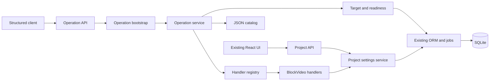
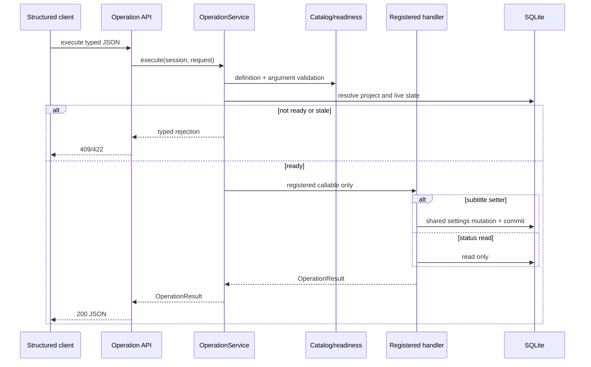

# BlockVideo Plan C — Detailed Technical Design

## D30 functional candidate boundary

Connection metadata reports the host-configured all_tools/semantic/stateful mode
without loading an index or exposing paths. The UI displays configuration rather
than asserting successful search. An isolated demo startup script selects ordinary
configuration before importing the application, then serves the built frontend
on loopback. It never imports the D29 comparison selector or injects experiment
state into product prompts. Search, parser, guards and execution remain separate.
See `plan-c/work-unit-30.md` for acceptance and outstanding decision boundaries.

## D29 comparison boundary

`evaluation.comparison` composes the existing Interpreter/SemanticInterpreter;
`evaluation.comparison_runner` supplies isolated databases to the unchanged
LanguageOperationService and registered OperationService. A structural candidate
interpreter protocol keeps application imports independent of evaluation code.
All modes share a frozen, allowlisted raw state snapshot, parser, value/reference
guards, final readiness, confirmations and transactions. Only candidate membership,
readiness presentation and the documented search stages differ. Experiment-only
CLI configuration enables Hard Filter; ordinary application configuration does not.
Review follow-up reporting excludes host-only/unmeasured trials from model timing,
separates deadline from transport failures, and retains partial reports after a
started experiment fails. Submit scoring additionally checks project status and
the full settings-history sequence. Reanalysis of immutable evidence is labelled
as offline rescoring, not new inference or a new acceptance run.
See `plan-c/work-unit-29.md` and `plan-c/comparison-modes.md`.


## D28 provisional candidate-state boundary

`operations.candidate_readiness` uses the existing target/busy check without
constructing an executable request. Immutable candidate DTOs belong to operation
contracts. Language orchestration supplies a read-only snapshot callback to the
semantic interpreter; the latter still cannot import DB/execution modules. Each
stage includes exact-version annotations without changing rank/membership. The
interpreter accepts only annotations for its offered candidates and selected target.
The language read-only refresh endpoint reads current state for recorded candidate
IDs, never runs a model/index/executor and never overwrites the old response.
`evaluation.readiness_filter` is an experiment-only consumer of these snapshots,
not imported by product modules. See `plan-c/work-unit-28.md`.

## D27 semantic interpretation boundary

`app.retrieval.ranking` adds read-only exact cosine ranking. The optional
`onnx_embeddings` adapter loads hash-pinned E5 data locally and uses masked mean
pooling with no silent truncation. `app.semantic_interpretation` composes retrieval
and the existing read-only interpreter; it cannot import a DB or an executor.
Language orchestration may inject this component after the durable claim and
before the unchanged guards/core. Source freshness is checked before and after
inference; fallback never widens static scope. See `plan-c/work-unit-27.md` for
the bounded5→8→full-scope policy, deadline and diagnostic contract. Index path
configuration is opt-in; no `.env`, default flow or comparison-mode UI changes.

## D26 index boundary

`app.retrieval` reads operation contracts/catalog only. `sources` extracts public
description/example/input documents and exact app/capability bindings from
`operations/search_scope.json`. `embeddings` returns normalized finite vectors
through a bounded loopback HTTP adapter. `builder` writes a content-addressed
bundle and atomically replaces its manifest; only `scripts.operation_index`
invokes it. `reader` checks current source hashes, model profile and regenerated
documents, then filters exact scope without inspecting live readiness. No package
imports execution, handlers, DB, evaluation corpora or language orchestration.
Existing application entry points do not import retrieval in D26.

This is index lifecycle infrastructure. D27 supplies cosine ranking and candidate
fallback; D28 adds state/readiness presentation; D29 connects comparison modes.
The developer CLI validates local weight bytes against the profile fingerprint;
the HTTP response must match the model ID and dimension. The local serving process
is trusted to use those weights: an API model name alone cannot attest its bytes.
No new dependency, migration or runtime configuration default is introduced.

## D25 diagnostic and development-probe boundary

See `plan-c/work-unit-25.md`. Language orchestration records additive timing and
candidate metadata in its existing response JSON; receipts still own effects.
Its observability helper emits a fixed allowlist, with process-local HMAC aliases
for identifiers, and never logs free text or exceptions. The interpreter remains
read-only. The frontend retains the frozen request while showing elapsed waiting
and the user-selected30-second notice separately from video progress.

The new development probe is an explicitly invoked script with loopback transport,
not a product dependency. It reads only approved development cases through the
D24 gate and records synthetic proposal accuracy separately from core effect tests.
The existing offline `scripts.evaluation_cases` still has no inference/network path.

D25 also changes model-facing argument property presentation. Settings output
uses three equivalent schema alternatives (alphabetical, common settings first,
and canonical order) because local constrained decoding can depend on key order.
Every alternative has exactly the catalog's fields and constraints. No candidate
is removed; the core schema, validation, transactions and generation permission
are unchanged. Probe manifests fingerprint the ordered payload and response
schema as well as the prompt/catalog/corpus. This is output compatibility, not
retrieval or final-evaluation scoring. See the D25 report for measured tradeoffs.

## D24 offline evaluation tooling

`backend/evaluation` owns data validation, content fingerprints, review ledgers
and offline review rendering. It reads operation metadata for label-schema checks;
the application never imports it. `scripts.evaluation_cases` has no interpreter,
database, provider or network execution path. Development examples remain in
`evaluation/d24`; held-out text/labels live outside the implementation workspace.
Only group/count/hash and review-status metadata returns to the implementation
agent. Approved subset manifests require separate, matching human and independent
AI ledgers. Later runners must use that eligibility gate; old development probes
do not become approved final evaluators automatically.

## D23 connection observability

See `plan-c/work-unit-23.md`. A separate read-only language connection route uses
the interpreter's transport URL validation and a bounded model-list reader. It
does not receive project input, invoke inference, select models or access the
operation executor. The UI shows only an allowlist of connection settings and
fixed status messages. Development probes own metrics and synthetic evidence;
production request/model bodies are not added to application logs.

The user authorized fixes for observed real-model accidental saves. Language
orchestration now checks supplied subtitle quantities, other numeric settings,
explicit speech-speed presence and known pending compound fields before creating
an executable request. Untrusted prior proposals may veto a partial save but
never provide executable arguments. Uncertain values ask; no automatic rewriting
or additional semantic repair call is added. LocalChatAdapter also rejects a
missing/mismatched response model ID before returning content to the interpreter.

## D22 compound intent and repair

See `plan-c/work-unit-22.md`. The interpreter still has no execution capability.
Version 2 of settings.update normalizes relative arguments in the core writer
transaction, then uses the existing settings handler. Language orchestration
persists generation intent and reconstructs a separate revision-bound generation
request from the settings receipt. Both receipts remain authoritative; no model
call or provider call runs inside a database writer transaction.

## D21 connection audit

See `plan-c/work-unit-21.md`. The settings editor already submits
`project.settings.update` through the durable core, as does language orchestration.
The legacy PATCH also uses `validate_settings` and `apply_project_settings`.
Verify specialized pronunciation validation and stage invalidation through these
entry points without adding a second settings writer or duplicate field handlers.

## D20 acceptance boundary

See `plan-c/work-unit-20.md`. Exercise existing production APIs, dialogue/core and
the managed generation pipeline in isolated synthetic storage. Fault injection
belongs only to the test runner. Acceptance fixes must preserve the dependency
direction and the immutable request/revision/confirmation contracts below.

## D19 dialogue boundary

See `plan-c/work-unit-19.md`. A dialogue ledger and orchestration helper retain
bounded context separately from immutable operation receipts. Models store data;
only orchestration reads it into a read-only interpretation context. An optional
server-injected core guard checks dialogue invalidation inside the same writer
transaction as effects, after replay lookup. No reverse import or model-defined
callable is permitted. Frontend continuation mode always creates a new request ID.
The language pronunciation helper binds proposed readings to supplied utterances
and merges additions into stored entries without exposing the existing glossary
to the model. Core revision/readiness validation still authorizes the final save.
`plan-c/work-report-19.md` records the final tests and actual model/browser/video
evidence. The additive `language_turns` table contains local utterance text; old
language records without a turn keep their replay behavior but cannot be continued.

## D18 UI boundary

See `plan-c/work-unit-18.md`. Frontend language contracts/client, durable session
storage, a request lifecycle hook and result presentation are separate modules.
The project page composes the panel with existing controls/history. No new model
interpreter, executor, retrieval or automatic generation path is introduced.
Server receipts and revision history own displayed effects; model prose does not.
Unknown HTTP delivery refreshes observed project/history state but never implies a
successful request. Explicit resend retains the exact input; reload only looks up.
`plan-c/work-report-18.md` records implementation and executed verification.

## D17 orchestration

See `plan-c/work-unit-17.md`. `language_operations` depends on interpretation,
operation metadata/core and the new language-request ledger. API routes compose
these parts; no reverse import into orchestration from operations or shared
services is permitted. The interpreter continues to have no execution capability.
Interpretation runs outside writer transactions. Core receipts own committed
effects and recover the gap between core commit and orchestration acknowledgement.
The reference-binding check rejects model-guessed job/history IDs before preparing
an executable request. It retains the model's parsed proposal and returns a separate
application clarification. Generation proposals always need a confirmation bound
to the stored request. See `plan-c/work-report-17.md` for verification and API use.

## D16 model boundary

The current requested addition is specified in `plan-c/work-unit-16.md`.
The new `app.interpretation` package depends only on operation metadata/schema,
its own contracts, and an injected transport. It must never depend on operation
execution/bootstrap/handlers, database/models, or workers. A synthetic CLI probe
owns HTTP transport lifetime. D17 separately adds orchestration/API routes, while
this interpreter has no execution capability. D18 adds the product UI above.
Local HTTP structured output support is checked against official LM Studio docs
and an actual synthetic probe; new SDK assumptions are not introduced.
The verified local configuration explicitly disables thinking for the bounded
768-token output (`reasoning_effort: "none"`). This setting is opt-in at the
transport boundary and does not weaken schema validation or add retries.
Actual test outcomes and limits are in `plan-c/work-report-16.md`.

## Current implementation contract: D12–D15

The user's D15 request and answered initial product questions authorize the work in
`plan-c/work-unit-12-15.md`. It supersedes D11's full-pipeline-only dispatch,
interrupted-job failure policy and deferred history/control statements below.
D11 replay/transaction guarantees and dependency direction remain mandatory.
Executed verification and G2 judgment are in `plan-c/work-report-12-15.md`.
`generation_plan` declares dependencies, `generation_snapshots` freezes inputs,
`artifact_store` verifies/publicizes immutable outputs, and `external_calls` journals
provider effects. API/history and operation handlers use these services; services
never import API/operations. Project/job ID reservations prevent reference reuse.

## Historical amendment: D11 (2026-09-19)

Read `plan-c/work-unit-11.md` for the approved-by-task D11 implementation contract.
It extends the G1 design below with durable receipts, integer project revisions,
transaction-owned commits, relative subtitle changes and a transactional pending
generation job. It supersedes G1's timestamp token and deferred-request sections.
The existing dependency direction remains: models and shared services never import
operations; the dispatcher depends on persisted models and the existing worker.
The user request authorizes this separate D11 change; units 01–10 records remain
historical evidence. No claim of a separate human design-review meeting is made.

## 1. Document Control

- **Project:** BlockVideo state-aware common operation foundation
- **Status:** Implementation-ready
- **Delivery mode:** Standard
- **Specification:** `specification.md`
- **DTD:** `docs/DTD.md`
- **Updated:** 2026-09-17
- **Baseline:** `main` at `00ae7cb3333d226bee97c742c7aa1db1dd81203c`
- **Scope:** Work units 01–10 only
- **Open blockers:** None for the typed core. Real VOICEVOX generation remains optional because the fake provider is the approved deterministic sample path.

## 2. Technical Scope

### In scope

1. Record the verified environment, baseline, code map, product decisions, commands, and unit evidence.
2. Add a synthetic, non-sensitive sample project payload and script that run with fake providers.
3. Add a typed operation core for two representative operations:
   - `project.subtitle-font-size.set`
   - `project.status.get`
4. Keep versioned operation definitions in Git-managed JSON.
5. Reject malformed definitions, duplicate IDs, unknown handlers, invalid targets, invalid values, stale state observations, and execution while a project has a live generation job.
6. Expose a thin structured HTTP entry that lists definitions, checks readiness, and executes requests.
7. Route normal `PATCH /api/projects/{id}` subtitle-size writes and operation-core subtitle-size writes through one settings mutation function.
8. Verify persistence after database reload without retrieval or LLM use.

### Deferred

Request ID persistence, durable revision columns, idempotent replay, regeneration planning, artifact revision binding, recovery, natural-language input, model integration, semantic retrieval, and comparison experiments are work units 11+.

### Runtime constraints

- Windows 11 target; repository remains cross-platform.
- Python `>=3.12`; local verified Python is 3.12.12.
- Node `>=20`; local verified Node is 24.11.1.
- Existing lockfiles remain authoritative.
- No new runtime or development dependency.
- SQLite and the process-local worker remain unchanged.
- All new Python public functions and methods use type hints.

### Acceptance criteria

- Existing baseline suites remain green.
- The fake-provider sample can create and generate a project when FFmpeg is available.
- Catalog loading fails for duplicate IDs, malformed schemas, or missing registered handlers.
- A candidate/provisional result cannot be executed.
- Execution always resolves the target and validates arguments/readiness again.
- Subtitle size accepts only integer values from 16 through 120.
- Missing/nonexistent targets and stale observations do not write.
- Status inspection never writes.
- Subtitle size persists and survives a new SQLAlchemy session.
- Existing PATCH and operation HTTP paths share the same settings mutation function.

## 3. Architecture and Dependency Direction



Allowed imports are monotonic:

```text
contracts
  <- catalog
  <- registry
  <- readiness
  <- handlers
catalog + registry + readiness + handlers
  <- service
service
  <- bootstrap
bootstrap
  <- operation API
project settings service
  <- project API and subtitle handler
```

Prohibited directions:

- `contracts`, `catalog`, `registry`, `readiness`, and `service` must not import API routes.
- Existing models and settings services must not import the operation package.
- The catalog must not import handlers or evaluate names as Python expressions.
- Frontend code must not be imported by backend code.

## 4. Technology Stack and Research Record

| Technology | Version/constraint | Role | Decision |
|---|---|---|---|
| Python | `>=3.12`; verified 3.12.12 | Backend/core/tests | Existing stack |
| FastAPI | locked 0.139.2 | Structured HTTP entry | Reuse existing router pattern |
| Pydantic | locked 2.13.4 | Strict contracts and catalog models | Reuse; no JSON-schema package added |
| SQLAlchemy | locked 2.0.51 | Target/status/settings persistence | Reuse synchronous session ownership |
| SQLite | Python/SQLAlchemy driver | Local durable project state | No schema change in units 01–10 |
| pytest | locked 9.1.1 | Contract/API/integration tests | Existing test framework |
| React/TypeScript | React 18.3.1; TS 5.9.3 | Existing UI regression only | No Plan C UI in this phase |
| Vitest | locked 2.1.9 | Frontend regression | Existing framework |
| FFmpeg | installed 9.0.1 | Sample MP4 generation | Official repository requirement |
| JSON | standard library | Operation source of truth | Chosen over YAML for strict, unambiguous machine data |

Primary sources verified 2026-09-17:

- Repository: <https://github.com/Rimcat-JA/blockvideo>
- FastAPI response/model behavior: <https://fastapi.tiangolo.com/>
- Pydantic models and JSON Schema: <https://docs.pydantic.dev/latest/concepts/models/> and <https://docs.pydantic.dev/latest/concepts/json_schema/>
- SQLAlchemy sessions: <https://docs.sqlalchemy.org/en/20/orm/session_basics.html>
- uv project synchronization: <https://docs.astral.sh/uv/concepts/projects/sync/>
- FFmpeg: <https://ffmpeg.org/documentation.html>

Repository manifests and lockfiles determine exact compatible versions. No LlamaIndex, Rasa, Outlines, retrieval library, or LLM SDK is introduced.

## 5. Dependency Inventory

### Python standard library

- `json`: `json.loads`; parse operation definitions. `catalog.py` owns file reads.
- `pathlib`: `Path`; locate catalog and sample files.
- `enum`: `Enum`; readiness/result labels.
- `typing`: `Any`, `Protocol`, `Callable`; typed handler boundaries.
- `datetime`: existing project `updated_at` is serialized as the observed state token.

### Pydantic

- Package: `pydantic==2.13.4`
- Symbols: `BaseModel`, `ConfigDict`, `Field`, `ValidationError`, `field_validator`, `model_validator`.
- Used by: operation contracts and catalog models.
- Ownership: immutable request/result values; no resources.
- Failures: `ValidationError` becomes catalog startup failure or HTTP 422.

### SQLAlchemy

- Package: `sqlalchemy==2.0.51`
- Symbols: `Session`, `select`.
- Used by: readiness, handlers, settings mutation, tests.
- Ownership: caller injects the request-scoped session; operation code never closes it.
- Failure: transaction errors propagate to FastAPI's bounded error handler; validation errors occur before mutation.

### FastAPI

- Package: `fastapi==0.139.2`
- Symbols: `APIRouter`, `Depends`, `HTTPException`.
- Used by: `app/api/routes_operations.py`.
- Semantics: synchronous handlers use the existing `get_db` dependency.

### Existing internal modules

- `app.models.project.Project`: target and settings state.
- `app.models.job.GenerationJob`, `JobStatus`: readiness evidence.
- `app.workers.job_runner.job_registry`: distinguish live work from historical rows.
- `app.services.invalidation.invalidate_project_settings`: preserve current downstream invalidation semantics.
- `app.db.get_db`: request session.

## 6. Repository Structure

```text
AGENTS.md
specification.md
docs/
├── DTD.md
├── plan-c/
│   ├── ai-environment.md
│   ├── commands.md
│   ├── current-system-map.md
│   ├── decisions.md
│   ├── operation-catalog.md
│   ├── contracts.md
│   ├── handoff.md
│   ├── work-report-01-10.md
│   └── tasks/work-unit-01.md ... work-unit-10.md
└── modules/operation-core.md
samples/
├── compose_multiplatform_intro.txt
├── plan_c_operation_demo.txt
└── plan_c_operation_demo.json
backend/app/
├── api/routes_operations.py
├── operations/
│   ├── __init__.py
│   ├── contracts.py
│   ├── catalog.py
│   ├── registry.py
│   ├── readiness.py
│   ├── handlers.py
│   ├── service.py
│   ├── bootstrap.py
│   └── definitions.json
└── services/project_settings.py
backend/tests/
├── test_operation_catalog.py
├── test_operation_service.py
└── test_operations_api.py
```

No broad directory migration is permitted.

## 7. Configuration and Secrets

No new environment variable or secret is introduced.

- Catalog path is package-local and fixed at `operations/definitions.json`.
- Tests may inject a temporary catalog `Path` directly.
- Sample payload sets `use_fake_providers: true` and contains no API key.
- Existing `.env` and `SecretStore` rules remain unchanged.
- External cost ceiling for this phase is zero: no paid provider is called.

## 8. Module and File Design

### `app/operations/contracts.py`

Responsibility: transport-independent typed contracts.

Public types:

```python
class Readiness(str, Enum):
    ready = "ready"
    needs_input = "needs_input"
    blocked = "blocked"
    unsupported = "unsupported"

class OperationTarget(BaseModel):
    project_id: int | None
    selected_project_id: int | None

class OperationRequest(BaseModel):
    operation_id: str
    operation_version: int = 1
    target: OperationTarget
    arguments: dict[str, Any]
    observed_state_revision: str | None = None

class ReadinessResult(BaseModel):
    operation_id: str
    readiness: Readiness
    reason_code: str | None
    missing_fields: list[str]
    project_id: int | None
    state_revision: str | None

class OperationResult(BaseModel):
    operation_id: str
    project_id: int
    changed: bool
    state_revision: str
    data: dict[str, Any]
```

All models use `extra="forbid"`. `project_id` and `selected_project_id` may not conflict. An executable request is separate from a future retrieved candidate; no candidate type is accepted by `execute`.

### `app/operations/catalog.py`

Responsibility: parse and validate versioned JSON definitions.

```python
def load_catalog(path: Path) -> OperationCatalog
def validate_arguments(definition: OperationDefinition, arguments: dict[str, Any]) -> dict[str, Any]
```

Supported schema subset is intentionally exact: object root, properties, required, additionalProperties, integer/string/boolean, minimum, maximum. Unsupported schema keywords cause catalog load failure rather than silent omission.

### `app/operations/registry.py`

Responsibility: explicit mapping from `handler_key` to callable.

```python
OperationHandler = Callable[[Session, Project, dict[str, Any]], OperationResult]
class HandlerRegistry:
    def register(self, key: str, handler: OperationHandler) -> None
    def require(self, key: str) -> OperationHandler
    def keys(self) -> frozenset[str]
```

Duplicate keys fail. `require` never imports/evaluates a catalog string.

### `app/operations/readiness.py`

Responsibility: target resolution and state checks.

```python
def resolve_project(db: Session, target: OperationTarget) -> Project | None
def project_state_revision(project: Project) -> str
def evaluate_readiness(db: Session, definition: OperationDefinition, target: OperationTarget) -> ReadinessResult
```

Rules:

1. Missing both target IDs → `needs_input`, `missing_fields=["project_id"]`.
2. Conflicting IDs → request validation error.
3. Missing row → `unsupported`, reason `target_not_found`.
4. A pending/running job that is live in `job_registry` → `blocked`, reason `project_busy`.
5. Otherwise → `ready` with current `updated_at` token.

Historical pending rows left after restart are not considered live in units 01–10; restart recovery is deferred.

### `app/services/project_settings.py`

Responsibility: one mutation path for validated project settings.

```python
def apply_project_settings(project: Project, updates: Mapping[str, Any]) -> set[str]
```

It calculates changed fields, assigns only existing project attributes, invokes `invalidate_project_settings`, and returns changed fields. It does not commit. The caller owns transaction boundaries.

### `app/operations/handlers.py`

```python
def set_subtitle_font_size(db: Session, project: Project, arguments: dict[str, Any]) -> OperationResult
def get_project_status(db: Session, project: Project, arguments: dict[str, Any]) -> OperationResult
```

- Setter receives already catalog-validated `{"value": int}`; it calls `apply_project_settings`, commits once, refreshes, and reports persisted value.
- Status handler performs no write and returns status, progress, stage, block count, output path, and error.

### `app/operations/service.py`

```python
class OperationService:
    def list_definitions(self) -> list[OperationDefinition]
    def readiness(self, db: Session, request: OperationRequest) -> ReadinessResult
    def execute(self, db: Session, request: OperationRequest) -> OperationResult
```

Execution order:

1. Resolve operation ID/version from catalog.
2. Validate argument names/types/ranges from catalog.
3. Resolve target and calculate final readiness.
4. If `observed_state_revision` is present and differs, reject with `stale_state`.
5. Reject every readiness other than `ready`.
6. Resolve the target project and repeat readiness/current-state validation.
7. Resolve the registered handler by key.
8. Invoke handler.
9. Return typed result.

### `app/operations/bootstrap.py`

Builds one immutable process-wide service from package JSON and an explicit registry. At import/startup it verifies every definition's handler exists and every registered handler is referenced. Tests may call `build_operation_service(catalog_path)`.

### `app/api/routes_operations.py`

Endpoints:

| Method | Path | Purpose | Result |
|---|---|---|---|
| GET | `/api/operations` | List source definitions | `list[OperationDefinition]` |
| POST | `/api/operations/readiness` | Final typed readiness check | `ReadinessResult` |
| POST | `/api/operations/execute` | Final validation and execution | `OperationResult` |

Mapping:

- Unknown operation/version: HTTP 404.
- Invalid arguments/target shape: HTTP 422.
- `needs_input`, `blocked`, `unsupported`, stale state: HTTP 409 with a machine-readable detail object.
- Successful status read or setting write: HTTP 200.

No shell string, retrieval result, or model output is accepted.

### `operations/definitions.json`

Contains exactly two version-1 definitions. Each has:

- `schema_version`
- `operation_id`
- `operation_version`
- `description`
- `examples`
- `input_schema`
- `handler_key`
- `affected_artifacts`
- `precondition_key`
- `postcondition_key`

Subtitle size schema requires only integer `value`, minimum 16, maximum 120, no extra keys. Status schema requires an empty object.

### Sample files

`plan_c_operation_demo.txt` is a short Japanese synthetic script with an authored slide, suitable for deterministic fake providers. `plan_c_operation_demo.json` is a complete `POST /api/projects` body referencing the same script content, title, fake-provider flag, and subtitle size 48. It contains no real identity, secret, or copyrighted user data.

## 9. Data Model Design

No database migration is made.

### Operation definition

| Field | Type | Rule |
|---|---|---|
| schema_version | int | exactly 1 |
| operation_id | str | lowercase dot/hyphen identifier, unique with version |
| operation_version | int | >=1 |
| description | str | non-empty |
| examples | list[str] | non-empty strings |
| input_schema | object | supported strict subset |
| handler_key | str | registered key |
| affected_artifacts | list[str] | descriptive only in this phase |
| precondition_key | str | known metadata, not evaluated dynamically |
| postcondition_key | str | known metadata, not evaluated dynamically |

### State revision

The phase uses `Project.updated_at.isoformat()` as an observation token. It is not claimed as the durable monotonic revision required by work unit 11. It prevents an explicitly observed stale request from proceeding in a single-process local workflow. Execution checks readiness once before target resolution and again immediately before dispatch. This narrows state drift but is not a cross-process lock; durable revision and concurrency control remain work unit 11 scope.

## 10. Internal Interfaces

- API owns `Session`; operation service borrows it synchronously.
- Service owns ordering and validation; handler owns operation-specific read/write.
- Handler never receives an unvalidated target or catalog-unknown field.
- Settings service mutates ORM state but never commits.
- Catalog data is immutable after process bootstrap.
- Exceptions are converted only at the API boundary.

## 11. External APIs

No new external API is called. Existing fake-provider sample generation uses existing internal provider interfaces and FFmpeg subprocess handling. Real OpenAI-compatible and VOICEVOX APIs are explicitly unnecessary for G1.

## 12. APIs Implemented by the Project

### Readiness request

```json
{
  "operation_id": "project.subtitle-font-size.set",
  "operation_version": 1,
  "target": {"project_id": 1},
  "arguments": {"value": 56}
}
```

Success:

```json
{
  "operation_id": "project.subtitle-font-size.set",
  "readiness": "ready",
  "reason_code": null,
  "missing_fields": [],
  "project_id": 1,
  "state_revision": "2026-09-17T12:00:00+00:00"
}
```

### Execute request

Same request, optionally adding `observed_state_revision`. Success data for setter:

```json
{
  "operation_id": "project.subtitle-font-size.set",
  "project_id": 1,
  "changed": true,
  "state_revision": "2026-09-17T12:01:00+00:00",
  "data": {"subtitle_font_size": 56}
}
```

Status execution uses `{}` arguments and returns the project state fields. Credentials and source script are excluded.

## 13. Runtime Flow



## 14. Error Handling and Resilience

- Catalog errors are fatal during service construction.
- Validation never partially mutates state.
- Unknown operation/version and unknown handler are distinct errors.
- `needs_input`, `blocked`, `unsupported`, and `stale_state` keep distinct reason codes.
- No retries occur in the operation core.
- No operation starts generation in this phase.
- Database commit failure propagates; SQLAlchemy rolls back when request scope closes. Tests verify no mutation for all validation failures.
- Existing global logging remains in force; arguments are non-secret for the two definitions.

## 15. Observability

Use existing Loguru configuration. Log operation ID, version, project ID, readiness, reason code, and changed flag. Never log source scripts, API keys, provider secrets, or whole request bodies. No metric/tracing dependency is added.

## 16. Security Design

- Local-machine trust boundary remains unchanged.
- Catalog strings never become imports, attributes, SQL, or shell commands.
- Only registry callables can execute.
- Pydantic rejects extra request fields.
- Catalog validation rejects extra arguments and wrong runtime types; `bool` is not accepted as integer.
- Target IDs are database lookups, not paths.
- Result excludes secrets and full source text.
- No model or retrieval component can write catalog files or call handlers directly.

## 17. Testing Design

### Catalog tests

- Valid package catalog loads two definitions.
- Duplicate ID/version fails.
- Unsupported schema keyword fails.
- Missing registered handler fails bootstrap.
- Unknown/extra/wrong-type/out-of-range arguments fail.

### Service tests

- Missing target → `needs_input`.
- nonexistent target → `unsupported`.
- live job → `blocked`.
- stale observed revision rejects without write.
- valid subtitle size writes and survives a new session.
- same subtitle size reports `changed=false`.
- invalid value never writes.
- status result is read-only.

### API tests

- list exposes both definitions.
- readiness/execute use structured JSON.
- malformed requests return 422.
- not-ready state returns machine-readable 409.
- setter and existing PATCH produce the same persisted value and invalidation state.

### Regression and smoke

```bash
cd backend && python -m uv run pytest
cd backend && python -m uv run ruff check .
cd frontend && npx -y pnpm@10.18.3 test
cd frontend && npx -y pnpm@10.18.3 build
cd frontend && npx -y pnpm@10.18.3 lint
```

Sample MP4 smoke uses fake providers and FFmpeg 9.0.1. It must record output path and size; failure must be reported rather than counted as pass.

## 18. Build, Run, and Deployment

Install:

```bash
python -m uv sync --project backend --extra dev --frozen
cd frontend && npx -y pnpm@10.18.3 install --frozen-lockfile
```

Run backend:

```bash
cd backend && python -m uv run uvicorn app.main:app --host 127.0.0.1 --port 8000
```

No deployment topology, port, container, or database change is introduced.

## 19. Implementation Roadmap

### Step 1 — Work units 01–05 records and sample

- **Prerequisites:** cloned baseline and verified tools.
- **Create:** specification, Plan C records/tasks, sample payload/script, AGENTS instructions.
- **Tests:** validate JSON and run baseline suites/sample pipeline.
- **Acceptance:** G0 evidence is explicit; unknown human budget is resolved as zero external spend for this phase.

### Step 2 — Contracts, catalog, and registry (units 06–07)

- **Prerequisites:** Step 1.
- **Create:** contracts, JSON definitions, catalog loader, registry, bootstrap.
- **Tests:** catalog and registry negative cases first.
- **Acceptance:** malformed/unregistered definitions cannot build the service.

### Step 3 — Resolution and readiness (unit 08)

- **Prerequisites:** Step 2.
- **Create:** readiness module and service readiness path.
- **Tests:** target, busy, stale, value, and reason-code cases first.
- **Acceptance:** every execution candidate is revalidated against current state.

### Step 4 — Representative operations and shared write path (unit 09)

- **Prerequisites:** Step 3.
- **Create:** settings service and handlers; modify project PATCH route.
- **Tests:** persistence and UI/API semantic equivalence first.
- **Acceptance:** subtitle write and status read work without LLM/retrieval.

### Step 5 — Thin HTTP entry and G1 (unit 10)

- **Prerequisites:** Step 4.
- **Create:** operation router; register in app.
- **Tests:** endpoint integration and bypass-negative cases first.
- **Acceptance:** listing/readiness/execution all reach one core; complete regressions pass.

### Step 6 — Reconcile documentation and review

- **Prerequisites:** Steps 1–5.
- **Modify:** DTD if implementation evidence differs; module note; report; handoff.
- **Verification:** full commands and independent review.
- **Acceptance:** documents describe only implemented behavior and identify work unit 11 as next.

## Implementation Instructions for Coding Agent

1. Implement roadmap steps sequentially.
2. Do not skip prerequisites.
3. Treat this DTD as the implementation contract.
4. Do not silently replace dependencies, APIs, schemas, boundaries, or algorithms.
5. Do not invent material architecture absent from this DTD.
6. Run specified verification after each step when feasible.
7. Update tests with implementation using red-green-refactor.
8. Preserve the dependency direction above; circular imports are forbidden.
9. Report unavailable APIs, incompatible versions, or unsatisfied criteria rather than redesigning silently.
10. If implementation evidence disproves this DTD, update the affected DTD section before continuing.
11. Keep work units 11+ deferred.
12. Preserve unrelated repository changes.
