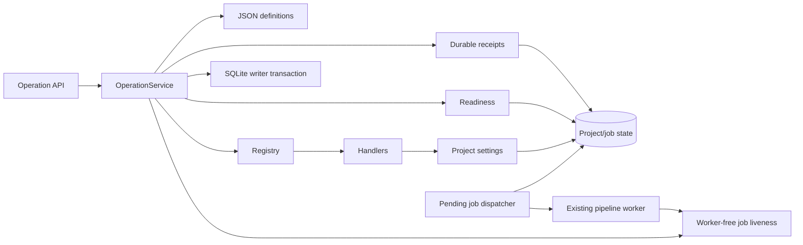

# Operation Core

## Purpose

Provide one typed, state-aware execution boundary for UI/API and natural-language
entry points. It owns durable replay, revisions, settings and generation intent,
input-bound history, recovery, cancellation, negative-intent vetoes, and registered
operation dispatch. D32–D33 retain the database-authoritative single-server model
while hardening dialogue/deletion races, lifespan cancellation, resumed completion,
and rename-before-commit recovery.

## Project Position

The package sits between structured HTTP routes and existing BlockVideo domain services. It owns operation lookup, strict arguments, target resolution, readiness, stale observations, and registered dispatch. BlockVideo handlers reuse existing ORM state and the shared project-settings service.

Imports point from transport to orchestration to contracts/domain state. The domain and settings services never import the operation package.

## Inputs and Outputs

- Input: strict `OperationRequest` with operation ID/version, target, arguments,
  request ID, base revision, generation flag and optional observed state token.
- Readiness: `ready`, `needs_input`, `blocked`, or `unsupported`, with reason and missing fields.
- Output: `OperationResult` with project/revision, changed flag, non-secret data,
  request/base revision, resolved arguments, generation flag, job and receipt reference.
- HTTP: `GET /api/operations`, `POST /api/operations/readiness`,
  `POST /api/operations/execute`, `GET /api/operations/requests/{request_id}`.

## Dependencies and Dependents

Direct external dependencies are existing Pydantic, SQLAlchemy, and FastAPI packages. The core reads `Project` and live `GenerationJob` state. Process-local task liveness is exposed by `services.job_liveness`, which has no worker, pipeline, or provider dependency; the worker only publishes and clears markers. Handlers call `apply_project_settings`; API routes depend on the process-wide service built by `bootstrap.py`.

## Control Flow

Under `BEGIN IMMEDIATE`, receipt replay precedes current-state checks; conflicting
content fails. New requests pass catalog, argument, target, readiness, and revision
checks before registered dispatch. Settings, revision, receipt, and optional pending
job commit together; provider work stays outside the transaction. Continuation claims
check the durable parent successor before revision, so later contenders resolve as
`dialogue_superseded`. Model output remains an untrusted proposal, and the D31
negative-intent guard dismisses vetoed requests before preparation or effects.

Deletion rejects active/unknown work and unresolved remote effects. After explicit
resolution it removes mutable rows transactionally, retains immutable receipts, then
drops process-local secrets and performs best-effort file cleanup. Registry liveness
is only an optimization: the persisted pending-to-running claim authorizes execution,
and startup returns only fingerprint-valid interrupted jobs to pending. FastAPI
startup reopens a fully drained `JobRegistry` before dispatcher creation. Shutdown
closes registry admission, stops the dispatcher, and then cancels and awaits every
previously accepted task while preserving durable running checkpoints. A closing
registry rejects submission before creating a task, cancellation event, or liveness
marker. Publication performs both an initial rename and orphan replacement only inside
the artifact writer transaction after exact running/cancellation, unresolved-call,
project, revision, job/settled fingerprint, and current-project/settled fingerprint
checks. Accepted pipeline checkpoints update the job snapshot/fingerprint together.
The exact same-job history destination is reference-checked even for identical bytes;
artifact-path, same-job artifact, project output/current, and non-job-path cases block
filesystem mutation before history/current pointers are written. Supplied subtitle
identity is checked before rename and again immediately before artifact construction.
The complete artifact manifest exists only in transactional
`GenerationArtifact.manifest_json`; publication never writes a per-job
`manifest.json`, while retrieval-index manifests remain separately owned. A late
subtitle mutation/deletion or database flush/commit failure rolls back database
publication and can leave only the permitted unreferenced same-job video orphan.

## Key Decisions and Limits

- JSON is the Git-managed operation source of truth.
- Catalog metadata and constraints fail closed at bootstrap.
- Subtitle changes are save-only unless generation is explicitly requested.
- `Project.revision` starts at 1 and advances for changed settings/user block edits and explicit historical restore.
  `state_revision` is its string representation; old timestamp tokens fail closed.
- SQLite writer locking serializes settings/request commits across processes. Media
  execution still supports one application server. Recovery is journal/checkpoint based;
  unknown external results are never blindly repeated.
- Status inspection remains available while generation runs; pending/running durable
  jobs and live legacy jobs block setting writes and project deletion. Deletion alone
  also blocks unknown jobs and unresolved remote calls; this does not broaden normal
  settings-edit readiness.
- Resolved external-call rows are deleted transactionally with their owning project;
  immutable operation receipts survive deletion. Secret and filesystem cleanup occur
  only after database commit, with filesystem removal remaining best effort.
- The dispatcher accepts a keyword-only injected registry, defaulting to the process
  singleton. A registry may submit a stale candidate, but the database job claim is
  authoritative and permits one execution. `JobRegistry.shutdown()` atomically closes
  admission before snapshotting, then cancels and awaits all accepted tasks without
  marking completion. FastAPI calls `start()` before each dispatcher lifespan and
  shutdown after stopping the dispatcher, preserving durable running checkpoints and
  supporting repeated application lifespans.
- A rename-before-publication orphan is replaceable only by a newly verified candidate
  for the same exactly running job at its exact history path after all publication
  eligibility checks pass in the writer transaction. Reference checks run even for
  identical bytes. Referenced/current artifacts and prior successful history remain
  immutable; committed publication replays its existing artifact row. The row's
  `manifest_json` is the only artifact manifest, so filesystem/DB crash skew is
  limited to the permitted unreferenced video orphan rather than a second manifest.
- Legacy absolute calls remain compatible without replay guarantees.
- Unexpected errors return fixed `internal_error` responses; logs exclude exception
  text, request/model bodies, prompts, private paths, and credentials.
- D31 adversarial checks compare exact persisted effects with zero journal changes;
  see its report for the bounded dependency and network claims.
- See `docs/plan-c/work-unit-12-15.md` for migration, retention and restart behavior,
  and `docs/plan-c/work-report-31.md` for D31 evidence and limits.

## Relevant Verification

- `backend/tests/test_operation_catalog.py`
- `backend/tests/test_operation_service.py`
- `backend/tests/test_operations_api.py`
- `backend/tests/test_operation_durability.py`
- `backend/tests/test_operation_processes.py`
- `backend/tests/test_operation_dispatcher.py`
- `backend/tests/test_operation_storage.py`
- `backend/tests/test_d31_adversarial_safety.py`
- `backend/tests/test_d32_concurrency_matrix.py`
- `backend/tests/test_d33_recovery_matrix.py`
- `cd backend && python -m uv run pytest`
- `cd backend && python -m uv run ruff check .`
