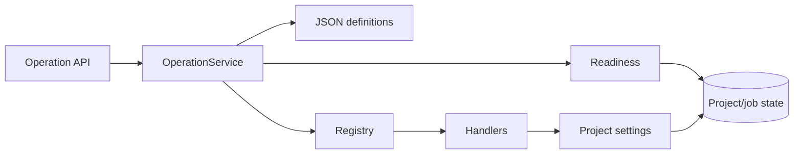

# Operation Core

## Purpose

Provide one typed, state-aware execution boundary for normal UI/API and later natural-language entry points. Work units 01–10 support subtitle-size writes and status reads without retrieval or an LLM.

## Project Position

The package sits between structured HTTP routes and existing BlockVideo domain services. It owns operation lookup, strict arguments, target resolution, readiness, stale observations, and registered dispatch. BlockVideo handlers reuse existing ORM state and the shared project-settings service.

Imports point from transport to orchestration to contracts/domain state. The domain and settings services never import the operation package.

## Inputs and Outputs

- Input: strict `OperationRequest` with ID/version, target, arguments, and optional observed state token.
- Readiness: `ready`, `needs_input`, `blocked`, or `unsupported`, with reason and missing fields.
- Output: `OperationResult` with project ID, changed flag, state token, and non-secret operation data.
- HTTP: `GET /api/operations`, `POST /api/operations/readiness`, and `POST /api/operations/execute`.

## Dependencies and Dependents

Direct external dependencies are existing Pydantic, SQLAlchemy, and FastAPI packages. The core reads `Project` and live `GenerationJob` state. Handlers call `apply_project_settings`; API routes depend on the process-wide service built by `bootstrap.py`.

## Control Flow

The service finds an exact catalog version, validates the catalog's strict schema subset, checks target/readiness, resolves the project, then repeats readiness immediately before registered dispatch. A stale observed token or any non-ready result stops before mutation. The registry maps stable keys to explicit callables; no dynamic import or evaluation exists.

## Key Decisions and Limits

- JSON is the Git-managed operation source of truth.
- Catalog metadata and constraints fail closed at bootstrap.
- Subtitle changes never start generation.
- `Project.updated_at` is only a G1 observation token. Durable monotonic revisions and request idempotency begin in work unit 11.
- Two back-to-back readiness checks narrow state drift but are not a cross-process lock. The current application is single-process; full concurrency control remains work unit 11 scope.
- Status inspection remains available while generation runs; setting writes are blocked by live process jobs.

## Relevant Verification

- `backend/tests/test_operation_catalog.py`
- `backend/tests/test_operation_service.py`
- `backend/tests/test_operations_api.py`
- `cd backend && python -m uv run pytest`
- `cd backend && python -m uv run ruff check .`
