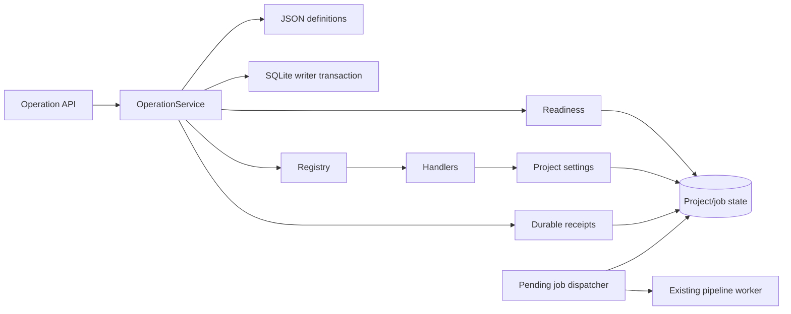

# Operation Core

## Purpose

Provide one typed, state-aware execution boundary for normal UI/API and later natural-language entry points. Units 01–10 add subtitle-size writes and status reads; D11 adds durable replay, revisions, relative adjustment and generation intent without retrieval or an LLM. D12–D15 adds dependency planning, input-bound video history, external-call recovery and independent control handlers.

## Project Position

The package sits between structured HTTP routes and existing BlockVideo domain services. It owns operation lookup, strict arguments, target resolution, readiness, stale observations, and registered dispatch. BlockVideo handlers reuse existing ORM state and the shared project-settings service.

Imports point from transport to orchestration to contracts/domain state. The domain and settings services never import the operation package.

## Inputs and Outputs

- Input: strict `OperationRequest` with operation ID/version, target, arguments,
  request ID, base revision, generation flag and optional observed state token.
- Readiness: `ready`, `needs_input`, `blocked`, or `unsupported`, with reason and missing fields.
- Output: `OperationResult` with project/revision, changed flag, non-secret data,
  request/base revision, resolved arguments, generation flag, job and receipt reference.
- HTTP: `GET /api/operations`, `POST /api/operations/readiness`,
  `POST /api/operations/execute`, `GET /api/operations/requests/{request_id}`.

## Dependencies and Dependents

Direct external dependencies are existing Pydantic, SQLAlchemy, and FastAPI packages. The core reads `Project` and live `GenerationJob` state. Handlers call `apply_project_settings`; API routes depend on the process-wide service built by `bootstrap.py`.

## Control Flow

Under `BEGIN IMMEDIATE`, the service looks up the request receipt first. A replay
returns its saved response before recalculating relative values or checking current
readiness. An ID conflict fails. A new request passes catalog/argument, target,
readiness and revision checks, resolves any delta to an absolute value, and invokes
the registered handler. Settings, revision, receipt and optional pending job commit
together. A dispatcher delivers committed pending jobs to the existing worker.
Provider work runs outside the transaction. Handler keys remain explicit callables.

## Key Decisions and Limits

- JSON is the Git-managed operation source of truth.
- Catalog metadata and constraints fail closed at bootstrap.
- Subtitle changes are save-only unless generation is explicitly requested.
- `Project.revision` starts at 1 and advances for changed settings/user block edits and explicit historical restore.
  `state_revision` is its string representation; old timestamp tokens fail closed.
- SQLite writer locking serializes settings/request commits across processes. Media
  execution still supports one application server. Recovery is journal/checkpoint based;
  unknown external results are never blindly repeated.
- Status inspection remains available while generation runs; pending/running durable
  jobs and live legacy jobs block setting writes and project deletion.
- Legacy absolute calls without request identity retain compatibility but no replay guarantee.
- See `docs/plan-c/work-unit-12-15.md` for migration, retention and restart behavior.

## Relevant Verification

- `backend/tests/test_operation_catalog.py`
- `backend/tests/test_operation_service.py`
- `backend/tests/test_operations_api.py`
- `backend/tests/test_operation_durability.py`
- `backend/tests/test_operation_processes.py`
- `backend/tests/test_operation_dispatcher.py`
- `backend/tests/test_operation_storage.py`
- `cd backend && python -m uv run pytest`
- `cd backend && python -m uv run ruff check .`
