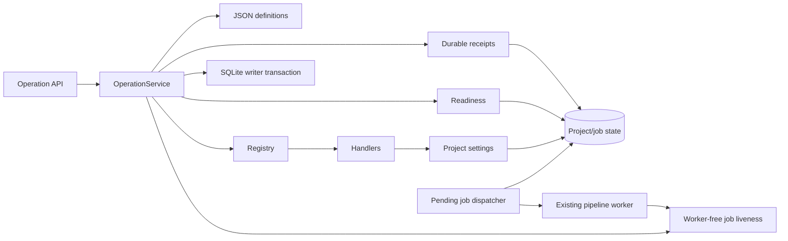

# Operation Core

## Purpose

Provide one typed, state-aware execution boundary for normal UI/API and
natural-language entry points. Units 01–10 add subtitle-size writes and status
reads; D11 adds durable replay, revisions, relative adjustment and generation
intent without retrieval or an LLM. D12–D15 adds dependency planning, input-bound
video history, external-call recovery and independent control handlers. D31 adds
a shared negative-intent veto before request construction and a fixed unexpected-
error boundary. D32 makes dialogue supersession precedence, deletion lifecycle
checks, and injectable startup dispatch explicit without changing the database-
authoritative single-server model.

## Project Position

The package sits between structured HTTP routes and existing BlockVideo domain services. It owns operation lookup, strict arguments, target resolution, readiness, stale observations, and registered dispatch. BlockVideo handlers reuse existing ORM state and the shared project-settings service.

Imports point from transport to orchestration to contracts/domain state. The domain and settings services never import the operation package.

## Inputs and Outputs

- Input: strict `OperationRequest` with operation ID/version, target, arguments,
  request ID, base revision, generation flag and optional observed state token.
- Readiness: `ready`, `needs_input`, `blocked`, or `unsupported`, with reason and missing fields.
- Output: `OperationResult` with project/revision, changed flag, non-secret data,
  request/base revision, resolved arguments, generation flag, job and receipt reference.
- HTTP: `GET /api/operations`, `POST /api/operations/readiness`,
  `POST /api/operations/execute`, `GET /api/operations/requests/{request_id}`.

## Dependencies and Dependents

Direct external dependencies are existing Pydantic, SQLAlchemy, and FastAPI packages. The core reads `Project` and live `GenerationJob` state. Process-local task liveness is exposed by `services.job_liveness`, which has no worker, pipeline, or provider dependency; the worker only publishes and clears markers. Handlers call `apply_project_settings`; API routes depend on the process-wide service built by `bootstrap.py`.

## Control Flow

Under `BEGIN IMMEDIATE`, the service looks up the request receipt first. A replay
returns its saved response before recalculating relative values or checking current
readiness. An ID conflict fails. A new request passes catalog/argument, target,
readiness and revision checks, resolves any delta to an absolute value, and invokes
the registered handler. Settings, revision, receipt and optional pending job commit
together. A dispatcher delivers committed pending jobs to the existing worker.
Provider work runs outside the transaction. Handler keys remain explicit
callables. For natural-language continuations, the claim transaction checks the
parent's durable successor before resolving project revision; once one successor
commits, later contenders persist `dialogue_superseded` rather than a revision-
dependent loser reason. For other natural-language requests, schema-valid model
output remains an untrusted proposal. The shared D31 guard vetoes documented global
or operation-family negative intent before `OperationRequest` construction; a veto
is dismissed without a prepared request, confirmation token, receipt, or core
effect.

Project deletion uses its own stricter guard: active work, an `unknown` job, or a
remote-side-effect call still `in_flight`/`unknown` returns conflict. After explicit
resolution, settings history, artifacts, resolved external-call rows, project and
cascaded job rows are removed in one writer transaction; immutable receipts survive
for exact replay. Process-local secrets are dropped only after commit, followed by
best-effort filesystem cleanup. Startup dispatch may receive an internal
`JobRegistry` for testing, but registry liveness is only an optimization: each
worker's persisted pending-to-running claim decides whether work executes.

## Key Decisions and Limits

- JSON is the Git-managed operation source of truth.
- Catalog metadata and constraints fail closed at bootstrap.
- Subtitle changes are save-only unless generation is explicitly requested.
- `Project.revision` starts at 1 and advances for changed settings/user block edits and explicit historical restore.
  `state_revision` is its string representation; old timestamp tokens fail closed.
- SQLite writer locking serializes settings/request commits across processes. Media
  execution still supports one application server. Recovery is journal/checkpoint based;
  unknown external results are never blindly repeated.
- Status inspection remains available while generation runs; pending/running durable
  jobs and live legacy jobs block setting writes and project deletion. Deletion alone
  also blocks unknown jobs and unresolved remote calls; this does not broaden normal
  settings-edit readiness.
- Resolved external-call rows are deleted transactionally with their owning project;
  immutable operation receipts survive deletion. Secret and filesystem cleanup occur
  only after database commit, with filesystem removal remaining best effort.
- The dispatcher accepts a keyword-only injected registry, defaulting to the process
  singleton. A registry may submit a stale candidate, but the database job claim is
  authoritative and permits one execution.
- Legacy absolute calls without request identity retain compatibility but no replay guarantee.
- Unexpected API exceptions return a fixed `internal_error` payload with a
  correlation ID. Logs retain the exception class, correlation ID, and matched route
  template, not exception text, request/model bodies, prompts, raw request paths,
  filesystem/private paths, or credentials.
- Deterministic adversarial verification accepts only an omitted target or the
  seeded project, then compares exact persisted content for settings/revision,
  jobs/cancellation, receipts, artifacts, and the external-call journal in both All
  Tools and stateful modes. Every case requires zero journal changes. A clean-process
  import blocker proves the runner/registered handler graph does not import workers,
  the media pipeline, or provider modules. These journal and dependency boundaries
  do not prove arbitrary future unjournaled network code is absent. This safety
  evidence is separate from real-model proposal quality.
- See `docs/plan-c/work-unit-12-15.md` for migration, retention and restart behavior,
  and `docs/plan-c/work-report-31.md` for D31 evidence and limits.

## Relevant Verification

- `backend/tests/test_operation_catalog.py`
- `backend/tests/test_operation_service.py`
- `backend/tests/test_operations_api.py`
- `backend/tests/test_operation_durability.py`
- `backend/tests/test_operation_processes.py`
- `backend/tests/test_operation_dispatcher.py`
- `backend/tests/test_operation_storage.py`
- `backend/tests/test_d31_adversarial_safety.py`
- `backend/tests/test_d32_concurrency_matrix.py`
- `cd backend && python -m uv run pytest`
- `cd backend && python -m uv run ruff check .`
