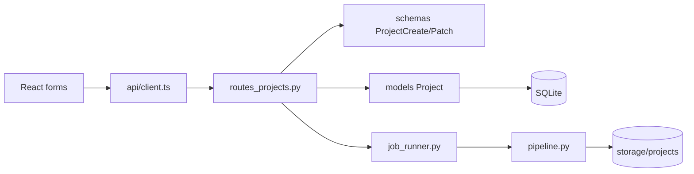

# Current System Map

## Existing save and generation path

- UI settings: `frontend/src/components/PacingSettings.tsx`, `ProjectForm.tsx`.
- HTTP boundary: `frontend/src/api/client.ts`; `backend/app/api/routes_projects.py`.
- Validation: `frontend/src/lib/validation.ts`; `backend/app/schemas/__init__.py`.
- Persistence: `backend/app/models/project.py`, `backend/app/db.py`.
- Setting invalidation: `backend/app/services/invalidation.py`.
- Jobs/generation: `backend/app/workers/job_runner.py`, `backend/app/services/pipeline.py`.
- Output publication: project `output_video_path` and `/api/projects/{id}/download`.

## Representative operation classification

| Operation | Existing capability | Plan C work |
|---|---|---|
| Set subtitle font size | Project PATCH and ORM field exist | Connect through shared settings service and typed operation handler |
| Get project status | Project GET exists | Provide typed operation result through common core |
| Generate/rerender/cancel | Existing APIs exist | Deferred from the operation core until units 11–15 |
| Natural-language commands | Not present on baseline | Deferred until unit 16+ |

The existing `PATCH /api/projects/{id}` has no frontend caller for existing projects. G1 verifies shared backend semantics rather than adding a new editor UI.
