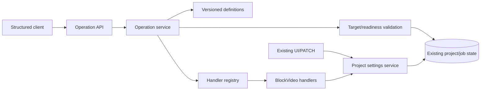

# BlockVideo Plan C Specification — Work Units 01–10

## Goal

Deliver the first Plan C gate: representative BlockVideo operations work through one typed, state-aware core without retrieval or an LLM. The first operations are subtitle-size modification and project-status inspection.

## Scope

### Included

- Reproducible environment and unchanged baseline evidence.
- Synthetic fake-provider sample project with no secret or external cost.
- Versioned operation definitions and explicit handler registration.
- Typed operation requests, readiness, reason codes, and results.
- Target, argument, state, and current-readiness validation.
- Shared subtitle-size persistence for the existing project PATCH API and the operation core.
- Thin structured HTTP endpoints for listing, readiness, and execution.
- Automated contract, negative, persistence, API, and regression tests.

### Deferred

Natural language, LLMs, retrieval, durable request IDs/revisions, idempotent replay, generation requests, retries, cancellation semantics, recovery, artifact revision binding, and comparison experiments.

## Product Rules

1. Changing settings during a live generation job is blocked, matching current behavior.
2. Subtitle font size is an integer from 16 to 120. “Slightly” means 2 px when a later language layer converts a relative request; the typed core receives a final absolute value.
3. An explicit project ID wins only when it agrees with selected context. Conflicting targets are invalid; an omitted target requires input.
4. Multi-operation atomic writes are deferred. This phase executes one operation request at a time.
5. Setting changes never start generation. Generation requires a separate explicit request in a later phase.
6. Normal reversible writes need no confirmation after target and value are unambiguous. Ambiguous, missing, blocked, stale, and unsupported cases do not execute.
7. Candidate or retrieved information is provisional. Only the core's final current-state validation can authorize a handler.
8. The operation catalog is Git-managed JSON. It contains metadata and schema only; it cannot execute arbitrary code.
9. External provider spend is zero for this phase. Sample generation uses fake providers.
10. The structured HTTP API is the development entry for G1; no user-facing CLI is added.

## Modules and Responsibilities

- **Operation core:** contracts, catalog loading, argument validation, readiness, registry, dispatch.
- **BlockVideo adapter:** subtitle setter and status reader.
- **Settings service:** one project-setting mutation rule shared by existing and new entry points.
- **Operation API:** thin JSON transport only.
- **Existing persistence:** SQLAlchemy/SQLite remains authoritative.

All dependencies point toward contracts and existing domain state. Reverse imports and cycles are prohibited.

## Public Contracts

### Operations

- `project.subtitle-font-size.set` version 1: arguments `{ "value": integer }`, range 16–120.
- `project.status.get` version 1: arguments `{}`.

### Readiness

- `ready`: final target/value/current-state checks pass.
- `needs_input`: target or required value is absent.
- `blocked`: operation exists but current live state forbids it.
- `unsupported`: operation or target does not exist in the current application scope.

Results include operation ID, resolved project ID, changed flag, state observation token, and non-secret data. Rejections retain machine-readable reason codes and missing fields.

## Critical Flow and Failure Behavior

A request is parsed, its operation/version is found, arguments are checked against the catalog, the project is resolved, live job/readiness is checked, and an optional observed state token is compared. Only then can the registry return an explicit callable. Any failure stops before mutation. The subtitle handler uses the shared settings mutation service and commits once. The status handler is read-only.

Catalog errors prevent service startup. Unknown operations return 404, malformed inputs return 422, and valid but non-executable requests return 409. Secrets, source scripts, shell commands, arbitrary imports, and model output are not accepted.

## Sample Project

The repository's existing `samples/compose_multiplatform_intro.txt` proves a basic sample exists. This phase adds a smaller Plan C-specific synthetic script and JSON payload to exercise subtitle-size persistence and fake-provider generation. The sample is generated test data and must not be described as user-provided content.

## Acceptance Criteria

- G0 records the actual baseline, tools, commands, decisions, test results, and limits.
- Existing backend and frontend suites remain green.
- Catalog and handler registration reject invalid startup state.
- Invalid target/value/state requests never save.
- State is rechecked immediately before dispatch.
- Subtitle-size writes persist after reload through the typed core.
- Existing PATCH and operation execution share mutation behavior.
- Status inspection returns current state without writing.
- Structured endpoints work without retrieval, LLM, or shell generation.
- Fake-provider sample generation produces an MP4 when FFmpeg is available.
- G1 report contains executed commands, counts, failures/skips, and known limits.

## Risks and Assumptions

- `updated_at` is only an observation token in this phase, not the durable monotonic revision planned for work unit 11.
- Process-local job liveness is authoritative for the existing single-process runtime. Restart recovery is deferred.
- Existing frontend forms do not edit an already-created project's subtitle size, so API semantic equivalence is verified at the shared backend service and persistence boundary.
- Real VOICEVOX and paid providers are outside deterministic G1 verification.
