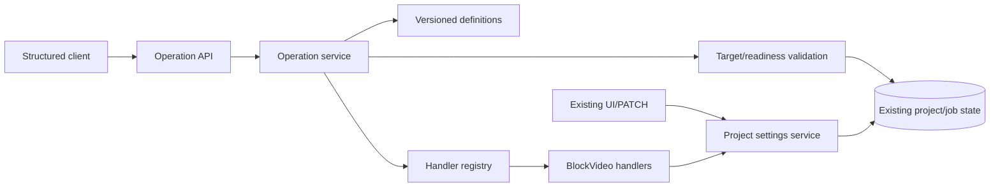

# BlockVideo Plan C Specification — Work Units 01–40

## D31–D40 hardening, blinded evaluation, and release-readiness design

The user selected sequential gated delivery and approved
`docs/plan-c/work-unit-31.md` through `work-unit-40.md` as the reviewer-oriented
contracts. D31–D35 harden adversarial input, concurrency, crash recovery, explicit
SQLite migration, and recovery UI. Validation uses deterministic tests first, then
bounded local-model, browser, and real-FFmpeg journeys where relevant; user data is
never used for destructive tests.

D36 freezes code and non-secret behavior inputs. D37 supplies a generic blinded
runner whose held-out corpus remains separately mounted and unread by the
implementation process. D38 accepts only a content-bound aggregate from a separate
evaluator. D39 verifies the exact frozen release candidate. D40 issues a readiness
decision without publication or deployment. All Tools remains the default unless
stateful retrieval has no worse safety outcome and at least equal approved held-out
task completion. Mandatory quality thresholds are 90% overall and 80% per evaluated
category, alongside zero unauthorized effects, replay, or secret disclosure.

Implementation remains layered: production `app` code never imports evaluation
tooling; migrations own schema upgrades/backups; UI consumes explicit backend
reason codes; test failpoints cannot be selected by public requests. D31 development
corpora are single-open byte-bounded inputs with strict bounded nested fixture
records. The D31 harness is single-target: an omitted target is allowed, but an
explicit target must equal the seeded initial project. Outcomes require exact
persisted effect counts, including zero external-call-journal changes, using
canonical collection contents rather than lengths, so positive controls cannot pass
on status alone. An executable dependency boundary keeps the runner and its
registered operation path from importing workers, the media pipeline, or provider
modules. This proves the journal and import boundaries exercised by D31, not the
absence of arbitrary future unjournaled network code.

D32 keeps SQLite `BEGIN IMMEDIATE`, receipts, revisions, persisted job claims, and
artifact publication as the correctness boundaries. A committed dialogue successor
wins before revision-based continuation validation. Deletion alone rejects active or
unknown jobs and unresolved remote calls; after explicit resolution it removes
mutable project rows, including resolved external-call rows, transactionally while
immutable receipts retain replay, then drops process-local secrets and performs
best-effort file cleanup after commit. Startup dispatch supports an internal injected
registry, but the database job claim remains authoritative. This is single-server
race correctness, not a multi-server or capacity claim.

Any behavior change after D36 creates a new candidate and invalidates affected
evaluation evidence.

## D30 functional candidate acceptance

`docs/plan-c/work-unit-30.md` verifies the normal application path with retrieval
disabled and with retained readiness-annotated retrieval enabled. The user chose
an isolated demo startup menu, with the configured mode shown in the UI. This
does not expose Hard Filter or let model/client proposals choose an execution
mode. G5 evidence must distinguish automated checks, real inference/media,
independent review, human acceptance and approved-commit integration.

## D29 controlled development comparison

`docs/plan-c/work-unit-29.md` connects B0, B1, B2, P1 and B0+ to the same
language orchestration and operation core through an experiment-only runner.
The ordinary application defaults do not change. Every mode allows clarification
and non-execution. Hard Filter retains unchecked-argument candidates and its
restricted pool remains binding during fallback. Held-out data stays unused.

## D28 retained candidates with provisional readiness

`docs/plan-c/work-unit-28.md` adds host-computed candidate state to semantic
interpretation without removing blocked operations or treating unknown arguments
as fully ready. Snapshots and current read-only refresh are separate from durable
results and final core validation. The user selected speech-speed changes during
generation: refuse the edit without cancelling generation or queuing the change.
Hard Filter remains an evaluation-only helper; D29 shared comparison is separate.

## D27 semantic candidates

`docs/plan-c/work-unit-27.md` defines optional local semantic retrieval and bounded
candidate expansion above the existing interpreter. Search failure is distinct
from unsupported, and no similarity score authorizes an effect. Approved
development recall and final proposal agreement are reported separately. The
existing All Tools default, durable replay, value guards and generation permission
remain unchanged. D28/D29 are separate work.

## D26 operation-derived vector index

`docs/plan-c/work-unit-26.md` defines an explicitly rebuilt local vector index,
source/version/model manifests and capability/application/exact-version filtering.
The user selected existing Nomic for index lifecycle checks; Japanese retrieval
quality remains D27. Generated index data never becomes the operation authority.
The current All Tools flow is unchanged, with no model index-update capability.

## D25 local-model usability and diagnostics

`docs/plan-c/work-unit-25.md` defines development-only tuning, pseudonymous
allowlisted operation logs, durable diagnostic metadata and waiting/failed-delivery
UI. The user selected a30-second slow notice. Interpretation and video-generation
time are separate; the notice never retries or cancels an operation. D24 pending
labels remain excluded, and the held-out corpus is not used for tuning.

## D24 evaluation material and human approval gate

`docs/plan-c/work-unit-24.md` defines synthetic Japanese cases grouped by source
request, separate development/held-out storage, independent label review and
content-bound human approval. This does not change application behavior or tune
the model. Human-unapproved cases are excluded from final metrics. A safe refusal
on an unambiguous executable request is not successful task completion.

## D23 local model configuration

`docs/plan-c/work-unit-23.md` defines the local configuration display/check and
observed real-inference probe. Reuse the existing loopback-only adapter and the
user-selected downloaded model. A reachable model listing is distinct from
successful inference. Never substitute a cloud model or fixed reply on failure.
After real-model failures, the user authorized preventing accidental saves in
D23 while retaining immediate save for grounded settings. Unspecified numeric
values, missing explicit speech speed and dropped known pending settings ask
before any partial save. Response model identity must match the selected ID.
These checks do not claim general semantic correctness; see the D23 report.

## D22 compound intent contract

`docs/plan-c/work-unit-22.md` extends DEC-07 with atomic multi-setting saves,
relative changes resolved by the core, and a separately confirmed generation
bound to the saved revision. Model repair is limited to one additional attempt
within a shared deadline and cannot execute or replay operations. Existing v1
receipts and single-operation requests remain compatible.

## D21 connection audit

`docs/plan-c/work-unit-21.md` defines the authorized next step after the user's D20
video acceptance. Inventory the initial settings through the existing shared core,
prioritizing subtitle mode, speech speed, speaker and pronunciation. Reuse existing
handlers and specialist validation; classify exclusions rather than adding duplicate
operation IDs. D22 compound intents and retrieval remain separate work.

## D20 acceptance scope

`docs/plan-c/work-unit-20.md` defines G3 acceptance: a continuous browser journey,
UI/DB/media reconciliation, regression checks, a short demo and updated remaining
work/cost/schedule. Synthetic provider verification and human/real-speech acceptance
are separate judgments. D21 is now separately authorized above; retrieval remains deferred.
`docs/plan-c/work-report-20.md` records the initial controlled test and the subsequent
real-model/VOICEVOX run. On 2026-09-20 the user accepted the demonstration video and
instructed work to proceed. D21 is authorized on that basis; hands-on user operation
was not reported and must not be recorded as performed. The initial twelve fixed
replies remain separate from the subsequent real-inference evidence (38/39 probes).

## D19 implementation contract

`docs/plan-c/work-unit-19.md` defines durable linked answers/corrections, pending
intent invalidation, explicit target switching and bounded dialogue context.
Corrections use the current saved value and new IDs. Old answers and superseded
confirmations must fail current-state checks before any effect.
The implementation and executed checks are recorded in `docs/plan-c/work-report-19.md`.
Dialogue utterances are stored locally, bounded per turn, separately from immutable
core receipts; application logs do not contain their bodies. The model receives at
most eight prior turns and 6000 characters of serialized dialogue plus current text.
Project switching retains pending requests per original target; this is an explicit
implementation assumption, not a user-confirmed preference. D20 remains separate.

## D18 implementation

`docs/plan-c/work-unit-18.md` defines the inline natural-language panel and result
card above the existing detail-page forms. The user chose the top-of-page layout.
Use D17's durable language API, confirmed core results, recorded setting differences
and verified job/artifact state. Reload looks up existing requests; only explicit
user actions submit or confirm. Retrieval remains D26–D27 and multi-turn state D19.
Executed browser and automated checks are recorded in `docs/plan-c/work-report-18.md`.

## D17 implementation

`docs/plan-c/work-unit-17.md` defines All Tools orchestration above the unchanged
read-only interpreter and existing operation core. Persist interpretation identity
before execution, reuse durable core receipts, bind target/revision outside the
model, and require explicit permission for generation proposals. D18 UI and D19
multi-turn corrections remain separate. Product choices and actual verification
are recorded in `docs/plan-c/work-report-17.md`. Settings save immediately;
generation requires separate confirmation. Ambiguous increments ask, while the
existing "slightly" rule remains 2 px. Explicit job/history references are checked
outside the model before execution; original structured interpretations remain
inspectable even when the application rejects a guessed reference.

## D16 implementation boundary

The user requested D16. `docs/plan-c/work-unit-16.md` defines the separate,
read-only model interpretation boundary and synthetic probe. Model output is a
strictly validated proposal and never executes an operation itself. D17 orchestration
is separate from that interpreter; D18 adds the product UI above. The D12–D15 guarantees below
continue unchanged.
D16 is verified with deterministic tests and the selected local Ternary Bonsai
model. `docs/plan-c/work-report-16.md` records the confirmed connection settings,
five synthetic cases, observed failures, corrections, and remaining D17/D18 scope.

## Current delivery: D12–D15

D12–D15 is implemented and verified. Read `docs/plan-c/work-report-12-15.md`
for executed evidence. Follow
`docs/plan-c/work-unit-12-15.md` for the implementation contract and the user's
choices: all successful video history, no edits while generating, arbitrary recorded
configuration restore, cooperative cancellation, and explicit retry using current
settings. Model interpretation is added separately in D16 above.

## Historical D11 amendment (superseded where D12–D15 extends it)

The user requested D11 from the production schedule. The following contract
extends the G1 baseline below; work units 12+ remain separate.

- Persist a globally unique client `request_id`, normalized request content,
  resolved project, base/result revision, resolved absolute arguments, explicit
  generation intent, job reference, and the original operation result.
- For durable setting requests, require both `request_id` and integer
  `base_revision`. Same ID/content returns the stored result before looking at
  current settings, readiness, or resolving a relative value. Different content
  with that ID returns HTTP 409. Rejected/uncommitted requests do not reserve IDs.
- Add `project.subtitle-font-size.adjust` v1 with strict integer `delta`.
  `delta: 2` represents the existing "slightly larger" rule. Resolve it once
  within the transaction; the final value must remain within 16–120.
- Add durable `Project.revision`, initially 1. Successful changed settings and
  user block edits advance it once; progress and artifact writes do not.
- Serialize short setting transactions with SQLite `BEGIN IMMEDIATE`. Revision
  validation, relative resolution, mutation, receipt and optional pending job
  insertion commit together or roll back together. Handler functions do not commit.
- `generation_requested: true` explicitly requests the existing full pipeline;
  a pending job is saved in the same transaction even for unchanged settings.
  A dispatcher picks up pending receipt-linked jobs, including after restart.
  Pending/running durable jobs block further project edits. Running jobs whose
  process was lost are reported failed at single-server startup, never blindly
  reissued to external providers. Full running-job recovery is D14 work.
- Preserve legacy absolute v1 calls without an ID (no replay guarantee) and the
  existing UI/API. ID-bearing status reads save a receipt but do not mutate the
  project. GET `/api/operations/requests/{request_id}` returns the saved result.
- No model call, new dependency, destructive migration, or D12 dependency planner
  is introduced. Verify same/different content, concurrent processes, crash before
  and after commit, restart replay, revision conflicts, and pending-job recovery.

The historical sections below describe work units 01–10. D11 details and migration
instructions are in `docs/plan-c/work-unit-11.md` and supersede the observation-only
revision and handler-owned-commit descriptions below.

## Goal

Deliver the first Plan C gate: representative BlockVideo operations work through one typed, state-aware core without retrieval or an LLM. The first operations are subtitle-size modification and project-status inspection.

## Scope

### Included

- Reproducible environment and unchanged baseline evidence.
- Synthetic fake-provider sample project with no secret or external cost.
- Versioned operation definitions and explicit handler registration.
- Typed operation requests, readiness, reason codes, and results.
- Target, argument, state, and current-readiness validation.
- Shared subtitle-size persistence for the existing project PATCH API and the operation core.
- Thin structured HTTP endpoints for listing, readiness, and execution.
- Automated contract, negative, persistence, API, and regression tests.

### Deferred

Natural language, LLMs, retrieval, durable request IDs/revisions, idempotent replay, generation requests, retries, cancellation semantics, recovery, artifact revision binding, and comparison experiments.

## Product Rules

1. Changing settings during a live generation job is blocked, matching current behavior.
2. Subtitle font size is an integer from 16 to 120. “Slightly” means 2 px when a later language layer converts a relative request; the typed core receives a final absolute value.
3. An explicit project ID wins only when it agrees with selected context. Conflicting targets are invalid; an omitted target requires input.
4. Multi-operation atomic writes are deferred. This phase executes one operation request at a time.
5. Setting changes never start generation. Generation requires a separate explicit request in a later phase.
6. Normal reversible writes need no confirmation after target and value are unambiguous. Ambiguous, missing, blocked, stale, and unsupported cases do not execute.
7. Candidate or retrieved information is provisional. Only the core's final current-state validation can authorize a handler.
8. The operation catalog is Git-managed JSON. It contains metadata and schema only; it cannot execute arbitrary code.
9. External provider spend is zero for this phase. Sample generation uses fake providers.
10. The structured HTTP API is the development entry for G1; no user-facing CLI is added.

## Modules and Responsibilities

- **Operation core:** contracts, catalog loading, argument validation, readiness, registry, dispatch.
- **BlockVideo adapter:** subtitle setter and status reader.
- **Settings service:** one project-setting mutation rule shared by existing and new entry points.
- **Operation API:** thin JSON transport only.
- **Existing persistence:** SQLAlchemy/SQLite remains authoritative.

All dependencies point toward contracts and existing domain state. Reverse imports and cycles are prohibited.

## Public Contracts

### Operations

- `project.subtitle-font-size.set` version 1: arguments `{ "value": integer }`, range 16–120.
- `project.status.get` version 1: arguments `{}`.

### Readiness

- `ready`: final target/value/current-state checks pass.
- `needs_input`: target or required value is absent.
- `blocked`: operation exists but current live state forbids it.
- `unsupported`: operation or target does not exist in the current application scope.

Results include operation ID, resolved project ID, changed flag, state observation token, and non-secret data. Rejections retain machine-readable reason codes and missing fields.

## Critical Flow and Failure Behavior

A request is parsed, its operation/version is found, arguments are checked against the catalog, the project is resolved, live job/readiness is checked, and an optional observed state token is compared. Only then can the registry return an explicit callable. Any failure stops before mutation. The subtitle handler uses the shared settings mutation service and commits once. The status handler is read-only.

Catalog errors prevent service startup. Unknown operations return 404, malformed inputs return 422, and valid but non-executable requests return 409. Secrets, source scripts, shell commands, arbitrary imports, and model output are not accepted.

## Sample Project

The repository's existing `samples/compose_multiplatform_intro.txt` proves a basic sample exists. This phase adds a smaller Plan C-specific synthetic script and JSON payload to exercise subtitle-size persistence and fake-provider generation. The sample is generated test data and must not be described as user-provided content.

## Acceptance Criteria

- G0 records the actual baseline, tools, commands, decisions, test results, and limits.
- Existing backend and frontend suites remain green.
- Catalog and handler registration reject invalid startup state.
- Invalid target/value/state requests never save.
- State is rechecked immediately before dispatch.
- Subtitle-size writes persist after reload through the typed core.
- Existing PATCH and operation execution share mutation behavior.
- Status inspection returns current state without writing.
- Structured endpoints work without retrieval, LLM, or shell generation.
- Fake-provider sample generation produces an MP4 when FFmpeg is available.
- G1 report contains executed commands, counts, failures/skips, and known limits.

## Risks and Assumptions

- `updated_at` is only an observation token in this phase, not the durable monotonic revision planned for work unit 11.
- Process-local job liveness is authoritative for the existing single-process runtime. Restart recovery is deferred.
- Existing frontend forms do not edit an already-created project's subtitle size, so API semantic equivalence is verified at the shared backend service and persistence boundary.
- Real VOICEVOX and paid providers are outside deterministic G1 verification.
